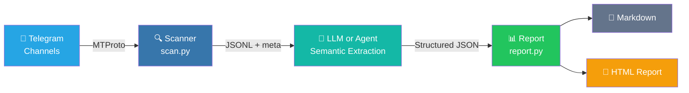

<div align="center">

<p>
  
</p>

<h3>Turn Telegram channel noise into a ranked daily signal report.</h3>

<p>
  <a href="https://www.python.org/downloads/"></a>
  <a href="LICENSE"></a>
  <a href="https://core.telegram.org/mtproto"></a>
  <a href="https://github.com/Sapientropic/tg-channel-scanner"></a>
  
</p>

<p><strong>Read subscribed channels -> apply a Markdown profile -> ship a self-contained HTML report.</strong></p>

<p>Built for job leads, airdrop watchlists, market/news tracking, and any Telegram workflow where the problem is too many channels and too little signal.</p>

<p>
  <a href="README.zh-CN.md"><strong>中文文档</strong></a>
  ·
  <a href="#demo"><strong>Demo</strong></a>
  ·
  <a href="#quick-start"><strong>Quick Start</strong></a>
  ·
  <a href="#report-output"><strong>Report Output</strong></a>
  ·
  <a href="ROADMAP.md"><strong>Roadmap</strong></a>
  ·
  <a href="#safety--telegram-tos"><strong>Safety</strong></a>
</p>

</div>

<table>
  <tr>
    <td align="center"><strong>Profile-driven</strong><br>Plain Markdown profiles define what counts as a match, reject, or follow-up.</td>
    <td align="center"><strong>Cutoff-aware</strong><br>Telethon reads through MTProto and stops as soon as messages fall outside your time window.</td>
    <td align="center"><strong>Report-ready</strong><br>Generate a single HTML file with semantic labels, source links, raw context, and stats.</td>
  </tr>
</table>

## Demo

<div align="center">

https://github.com/user-attachments/assets/d3a6fd44-7140-4843-86af-b32325abae33

</div>

<p align="center"><em>49s walkthrough preview. Source MP4: <a href="docs/demo.mp4">docs/demo.mp4</a>.</em></p>

---

## Quick Start

### Prerequisites

- Python 3.12+
- Telegram account (phone number)
- Telegram API credentials (`api_id` + `api_hash` from [my.telegram.org/apps](https://my.telegram.org/apps))

### Install And Open Signal Desk

On Windows, open the app-style local dashboard first:

1. Download or clone this repository.
2. Double-click `Signal Desk.bat`.
3. Keep the launcher window open while you use Signal Desk in the browser.

The first launch creates the local Python environment, initializes the jobs
starter workspace, builds dashboard assets when Node/npm is available, and opens
Signal Desk on `127.0.0.1`. If 8765 is already a compatible Signal Desk, the
launcher opens it; if another app is using 8765, Signal Desk tries 8766-8799.
After that, use the `Start` tab for setup, Telegram login, demo runs, source
checks, first dry-run scans, feedback export, and schedule previews.

If you prefer the terminal install path:

```bash
git clone https://github.com/Sapientropic/tg-channel-scanner.git
cd tg-channel-scanner
chmod +x setup.sh tgcs scripts/scan.sh
./setup.sh
```

### Configure & Run

Use Signal Desk's `Start` tab for the normal human flow:

- Try the offline demo without Telegram or LLM credentials.
- Save your Telegram app ID/hash locally.
- Connect Telegram with phone, code, and 2FA prompts in the browser.
- Initialize or repair the jobs workspace.
- Paste Telegram channels in `Settings` -> `Add Sources`, preview duplicates,
  and import them into the local source registry.
- Review saved channels in `Settings` -> `Saved Sources`, and pause or resume a
  source, filter by topic, or edit its topic tags without opening
  `.tgcs/sources.json`.
- Run the first `jobs-fast` dry-run scan.
- Use `Start` -> `Notifications` or open `Settings` directly to set the
  Telegram notification chat ID, save it muted or live, and run a dry-run
  notification test without sending a message. `Start` shows whether
  notifications are `Enabled`, `Muted`, or still missing a chat ID; missing or
  muted states include an app button that opens the notification settings.
- Export feedback, preview the dry-run cadence, and turn Windows dry-run
  automation on or off without typing a command.

Commands remain available for experts and agents:

<details>
<summary>Expert CLI fallback</summary>

```bash
# 0. Try the offline demo first (no Telegram login or LLM key required)
./tgcs demo
#    Writes output/demo-report.html

# 1. Edit config with your Telegram API credentials
#    (setup.sh created it at ~/.config/tgcli/config.toml)
nano ~/.config/tgcli/config.toml

# 2. Check first-run prerequisites for the developer-opportunity starter
#    setup.sh already initialized local .tgcs defaults with --starter jobs
./tgcs quickstart jobs
./tgcs doctor --profile jobs

# 3. Complete Telegram login once
./tgcs login

# 4. Run the jobs-fast monitor once without sending alerts
./tgcs monitor run --profile-id jobs-fast --delivery-mode dry-run
```

</details>

On Windows, use `tgcs.bat` instead of `./tgcs` when using the expert CLI. The
human facade defaults to
the local `.tgcs/config.toml` profile, `.tgcs/sources.json`, `output/`, HTML
output, and v0.4 local decision memory at `.tgcs/state`. `setup.*` initializes
the jobs starter by default; use `tgcs run --no-state` when you need a stateless
daily-report run.

### v0.5-alpha Monitor & Inbox

The v0.5-alpha monitor keeps the CLI-compatible engine and adds repeated-run
state, alert events, and a local review inbox. Signal Desk is the primary human
surface; these commands are the expert/agent fallback:

```bash
# Write .tgcs/profiles.toml if you want an editable monitor config
./tgcs monitor init-config

# For the developer-opportunity lane, initialize directly from channel_lists/jobs.txt
# Existing .tgcs/sources.json files are kept and merged with the jobs topic tag.
./tgcs init --starter jobs

# Show the one current next action for the jobs starter
./tgcs quickstart jobs

# Run one profile monitor; dry-run delivery is the safe default
./tgcs monitor run --profile-id market-news --delivery-mode dry-run

# Fast developer opportunity alerts: install only after live delivery is intentional
./tgcs monitor run --profile-id jobs-fast --delivery-mode live

# Import real opportunity channels into the jobs-fast lane
./tgcs sources import channel_lists/jobs.txt --topic jobs

# Review or export only one profile lane's sources
./tgcs sources list --topic jobs
./tgcs sources export --topic jobs --output output/jobs-sources.txt

# Print a dry-run scheduler command without installing it
./tgcs schedule print --profile-id jobs-fast --interval-minutes 15 --delivery-mode dry-run

# Serve the optional localhost dashboard; first launch auto-builds dashboard/dist
./tgcs dashboard

# Export reviewed dashboard decisions back into reusable report feedback
./tgcs feedback export
```

Monitor runs write artifacts under `output/runs/<run_id>/`, update a
`run_manifest_v1`, and store dashboard state in `.tgcs/tgcs.db`. High-priority
new or changed items become alert candidates and pending review cards. Telegram
Bot delivery resolves tokens in this order: `TGCS_TELEGRAM_BOT_TOKEN`, then the
Windows Credential Manager token saved from Signal Desk Settings. Tokens are
never stored in SQLite, manifests, reports, or docs.

Signal Desk's `Start` tab wraps the safe repo-local setup and dry-run flows as
guided controls: jobs init, offline demo, doctor, source validation and import,
Telegram setup/login, monitor dry-run, feedback export, scheduler preview,
Windows dry-run scheduler on/off controls, and a read-only automation status
check. If notification setup is missing or muted, the Start summary opens the
Settings notification editor directly instead of asking the user to copy a
command.
`Settings` lets a non-CLI user paste Telegram source handles or `t.me` links,
preview the import, save them into `.tgcs/sources.json`, review saved sources,
filter saved sources by topic, page through large source libraries, pause or
resume individual channels, edit the default Telegram notification chat ID,
save or clear the local bot token on Windows, mute or enable notifications, and
run a dry-run notification test.
`Profiles` lets the same user pause or re-enable a monitor profile, change its
scan window, and adjust the per-run item limit from the Desk before the next
run, without editing profile TOML.
Signal Desk hides copyable commands behind troubleshooting details instead of
making CLI copy the primary action. The only Desk-created system schedule is
the confirmed Windows Task Scheduler dry-run task for `jobs-fast`; the Desk
status check only queries whether that fixed task exists. Live schedules,
Telegram sessions, and raw Telegram messages remain guarded human-owned
boundaries. Non-Windows token keychain support is not claimed in this alpha.
Tokens, sessions, and raw Telegram messages are never echoed into the UI.

The built-in `jobs-fast` monitor keeps developer opportunity alerts separate from the daily audit
report. It scans a 2-hour catch-up window, but only interrupts for high-priority
new or changed roles, contracts, freelance gigs, or Mini Apps/TON projects whose source message is within the last 60 minutes. The
high-frequency path first applies a local keyword prefilter, so runs with no
opportunity-signal keywords skip the report/LLM stage entirely. The dashboard can switch
each profile between active/paused monitoring, work-hours alerts, all-day alerts, and muted delivery, tune
the scan window and per-run item limit, and
its Yield History and Source Actions panels help review which job channels
produce fresh messages, which sources produce high-value leads, which sources
need more observation, and which noisy sources may be prune candidates.
Import real opportunity sources from Signal Desk `Settings` when working as a
human. The expert CLI fallback is
`./tgcs sources import <channel-list> --topic jobs`; both paths add the topic to
existing matching sources, so `jobs-fast` will keep using a topic-filtered
registry instead of silently falling back to placeholder sources.

`./tgcs doctor` also checks whether dashboard assets are already built. Missing
assets are only a warning because `./tgcs dashboard` can build them on first
launch when Node/npm is available.

Dashboard keep/skip/false-positive decisions can be exported from Settings or
as note-free `tgcs-feedback-v1` JSONL with `./tgcs feedback export`, then reused
by the decision-memory path through `--feedback-jsonl output/feedback/review-feedback.jsonl`.
When the latest run has actionable review cards, the first screen opens directly
on the queue and triage controls. Otherwise the board keeps the latest-run
summary compact: one human task label, one action/all-clear/source-fix headline,
and a scanned -> matched -> cards -> action funnel instead of repeating the full
report in prose.
The Runs tab also opens generated reports through a local-only artifact route
restricted to report Markdown/HTML files under workspace-local `runs/`
directories. Monitor reports use human-readable names such as
`developer-opportunity-signal-report-2026-05-09-1225.html`, while the dashboard
displays the profile report title/category instead of raw absolute paths or the
high-frequency lane id. When a run has both Markdown and HTML reports, the
dashboard opens HTML by default for phone-friendly reading; Markdown-only
reports are rendered through the same local route instead of shown as raw text.
Dashboard state projects runs down to counts, health, a human task label, and
one report artifact, and projects profiles down to display labels plus
alert/source limits; raw scan artifacts, full profile config, registry paths,
hashes, and error files stay in local manifests for debugging. The Dashboard is
kept ADHD-friendly: top metrics are compact readouts, repository operations stay
in Settings instead of every board, Inbox uses a triage distribution bar, and
Runs use a fixed seven-day health chart plus a capped evidence ledger instead of
an ever-growing row of run cells or repeated report titles.

For the interrupt lane, `jobs-fast` caps semantic extraction at 20 matched
messages and 2000 output tokens. Keep the daily audit/backfill lane for
exhaustive review over larger windows.
`./tgcs schedule print` only prints a Windows Task Scheduler or cron command for
review; it does not create a system task by itself.

When `OPENAI_API_KEY` is not configured and `DEEPSEEK_API_KEY` is present,
semantic extraction defaults to `deepseek-v4-flash` with thinking disabled and
JSON output requested, even if MiniMax is also configured. MiniMax M2.7 is also
supported through the official OpenAI-compatible endpoint: set
`MINIMAX_TOKEN_PLAN_KEY` for a Token Plan key or `MINIMAX_API_KEY` for a
standard platform key. Token Plan keys default to the China-region endpoint
`https://api.minimaxi.com/v1`; standard platform keys default to
`https://api.minimax.io/v1`. Set `MINIMAX_BASE_URL` when your account needs an
explicit endpoint override. Use the local eval to compare provider latency,
JSON reliability, and aggregate token
usage on your history without copying raw Telegram text into the result
artifact. Workspace-local input paths are stored as relative paths; external
input paths are reduced to file names and disambiguated with a short hash only
when duplicate basenames would collide:

```bash
python scripts/eval_deepseek_cache.py --sample-size 20 --repeat 3 --format json
python scripts/eval_deepseek_cache.py --sample-sizes 10,20,30 \
  --models deepseek-v4-flash,MiniMax-M2.7 --repeat 1 --max-tokens 1000 --format json
```

### Agent-Native Mode

The repository also ships a root [SKILL.md](SKILL.md) and a structured
[agent CLI contract](docs/agent-cli-contract.md). The short `tgcs` command is
for humans. Agents should prefer the explicit JSON contract and the private
source registry at `.tgcs/sources.json`:

```bash
python scripts/source_registry.py import-list channel_lists/example.txt \
  --source-registry .tgcs/sources.json --format json

python scripts/source_registry.py import-list channel_lists/jobs.txt \
  --source-registry .tgcs/sources.json --topic jobs --format json

python scripts/doctor.py --source-registry .tgcs/sources.json \
  --profile profiles/templates/market-news.md --output-dir output --format json

python scripts/scan.py --source-registry .tgcs/sources.json --hours 24 \
  --output output/scan.jsonl --format json

python scripts/report.py --input output/scan.jsonl \
  --profile profiles/templates/market-news.md \
  --output output/report.md --html-output output/report.html \
  --source-registry .tgcs/sources.json --format json

# Optional v0.4 decision memory and feedback import
python scripts/report.py --input output/scan.jsonl \
  --profile profiles/templates/market-news.md \
  --items-json output/extracted-items.json \
  --output output/report.md --html-output output/report.html \
  --source-registry .tgcs/sources.json \
  --state-dir .tgcs/state \
  --feedback-jsonl output/report-feedback.jsonl \
  --format json

# Optional v0.5-alpha monitor state, manifest, inbox, and alert events
python scripts/monitor.py run --profile-id market-news \
  --delivery-mode dry-run --format json

python scripts/monitor.py feedback-export \
  --db .tgcs/tgcs.db --output output/feedback/review-feedback.jsonl --format json
```

If no LLM provider key exists, `report.py --extractor auto` returns
`agent_extraction_required`; the agent can read the local extraction request,
write `semantic_items_v1`, then rerun `report.py` with `--items-json`.

Passing `--state-dir .tgcs/state` turns on local decision intelligence:
items are marked as new, seen, changed, recurring, or expired across runs.
The state file stores only item keys, source refs, counters, fingerprints,
rating history, and feedback counts. It does not store raw Telegram message
text or feedback note bodies.

### Scan Options

```bash
# Past 24 hours (default)
./scripts/scan.sh channel_lists/example.txt

# Past 7 days
./scripts/scan.sh channel_lists/example.txt 168

# From a precise ISO-8601 cutoff
./scripts/scan.sh channel_lists/example.txt --since 2026-05-06T07:30:00Z
```

The scanner uses Telethon (MTProto) with `iter_messages` and early termination — it stops as soon as it hits a message older than your cutoff. No over-fetching.

<details>
<summary>Environment variables</summary>

```bash
SCAN_INITIAL_LIMIT=200   # initial read limit per channel
SCAN_MAX_LIMIT=5000      # hard cap before reporting incomplete
SCAN_DELAY=1             # seconds between channels
SCAN_MAX_FLOOD_WAIT_SECONDS=300
TG_SCANNER_CONFIG_DIR=~/.config/tgcli
```

</details>

### Export Channels from Telegram

```bash
python scripts/export_folder.py --list
python scripts/export_folder.py --folder "Jobs" --output channel_lists/jobs.txt
```

### Generate Reports

```bash
# Human default: market-news + HTML + .tgcs/state
./tgcs run

# Human alternate profile
./tgcs run --profile jobs --hours 72

# Markdown + HTML report
python scripts/daily_report.py channel_lists/example.txt \
  --profile profiles/example.md --html

# Custom LLM endpoint (DeepSeek, Ollama, etc.)
# If only DEEPSEEK_API_KEY is set, these DeepSeek defaults are selected automatically.
python scripts/report.py --input output/scan_XXXX.jsonl \
  --profile profiles/example.md \
  --base-url https://api.deepseek.com/v1 --model deepseek-chat

# Redact contact info before sending to LLM
python scripts/report.py --input output/scan_XXXX.jsonl \
  --profile profiles/example.md --redact-contact-info

# Preview prompt without calling LLM
python scripts/report.py --input output/scan_XXXX.jsonl \
  --profile profiles/example.md --dry-run-prompt output/prompt-preview.md
```

## Report Output

The generated report is designed to be read as a decision surface: what matters, why it matched, where it came from, and whether it deserves action.

<table>
  <tr>
    <td align="center" width="50%">
      <br>
      <sub>Retro-pixel masthead, scan metadata, and dashboard counters.</sub>
    </td>
    <td align="center" width="50%">
      <br>
      <sub>Ranked cards with action labels, rationale, source chips, and raw message access.</sub>
    </td>
  </tr>
</table>

The HTML report is a single portable file with inline CSS, JS, and icon assets: premium retro-pixel styling, light/dark themes, dashboard counters, scroll-parallax cards, expandable raw messages, and Telegram deep links. Web fonts are an optional enhancement; system fallbacks keep the report readable offline.

<details>
<summary>Scheduling examples</summary>

```bash
# cron: every day at 09:00
0 9 * * * cd /path/to/tg-channel-scanner && .venv/bin/python scripts/daily_report.py channel_lists/example.txt --profile profiles/example.md
```

```bat
REM Windows Task Scheduler
cmd /c "cd /d C:\path\to\tg-channel-scanner && .venv\Scripts\python.exe scripts\daily_report.py channel_lists\example.txt --profile profiles\example.md"
```

</details>

<details>
<summary>Free-form AI summary & Media OCR</summary>

**Free-form summary** (no fixed layout, just a digest):

```bash
python scripts/summarize.py --input output/scan_XXXX.jsonl --profile profiles/example.md
```

**Media OCR/STT** (off by default):

```bash
# xAI vision
export XAI_API_KEY=your-key
./scripts/scan.sh channel_lists/example.txt --ocr --ocr-provider xai

# OpenAI vision
export OPENAI_API_KEY=sk-your-key
./scripts/scan.sh channel_lists/example.txt --ocr --ocr-provider openai

# Custom endpoint
./scripts/scan.sh channel_lists/example.txt --ocr --ocr-provider custom \
  --ocr-base-url http://localhost:11434/v1 --ocr-model your-vision-model
```

Video OCR is thumbnail-first by default, including standalone reprocessing with
`python scripts/ocr_media.py`. Use `--ocr-full-video` during scans, or
`--full-video` with `ocr_media.py`, only when you explicitly want full-video
processing. Full-video mode requires `ffmpeg` and can send extracted frames,
audio, or transcripts to the selected OCR/STT provider, so review privacy and
cost before enabling it.

</details>

---

## How It Works



1. **Read** — Telethon reads messages from your subscribed channels
2. **Filter** — Precise timestamp cutoff with early termination
3. **Save** — JSONL + `.meta.json` sidecar
4. **Report** — LLM or agent semantic extraction -> Python renders stats + Markdown/HTML

Data contract: each scanned message carries a stable `message_ref` (`channel` + `id`).
Reports ask the LLM for `source_message_refs` and use that channel-scoped key for raw
message lookup; `source_message_ids` is kept only for older JSONL/report compatibility.
The daily pipeline passes an explicit scan `--output` path into `report.py`, so a report
cannot silently reuse an older `scan_*.jsonl` from the output directory.
If no LLM key is configured, the same report flow can hand semantic extraction to the
calling agent through the local `agent_extraction_request_v1` / `semantic_items_v1`
contract documented in [docs/agent-cli-contract.md](docs/agent-cli-contract.md).

## Profiles & Channel Lists

### Profile

Start from a built-in template, or copy `profiles/example.md` for the legacy job-focused sample:

```bash
cp profiles/templates/jobs.md profiles/my-profile.md
cp profiles/templates/airdrops.md profiles/my-airdrops.md
cp profiles/templates/market-news.md profiles/my-market-news.md
```

Available templates: jobs, airdrops, market/news, research leads, and competitor monitoring.

Edit the copied profile:

```markdown
## Candidate
- Role: Frontend Developer
- Stack: React, TypeScript, Next.js
- Level: Middle/Senior
- Location: Remote preferred

## Filter Rules
- Only include jobs from last 24 hours
- Remove duplicates (same company + title)
- Exclude: Backend-only, Mobile, DevOps...
```

Custom modes (airdrops, news, events) add `## Extraction Schema`, `## Extraction Prompt`, and `## Report Labels` sections. See `profiles/example-airdrop.md`.

### Channel List

Create a `.txt` in `channel_lists/` with **Telegram usernames** (not display names), one per line:

```
remote_italic
dev_jobs_remote
react_jobs
```

> Find a channel's username: open in Telegram → tap name → look for @username.

Or export directly from Telegram: `python scripts/export_folder.py --folder "Jobs" --output channel_lists/jobs.txt`

### Source Registry

For human source setup, prefer Signal Desk `Settings`: paste channels in `Add
Sources`, then use `Saved Sources` to filter by topic, pause, resume, or retag
individual channels. For agent-maintained source operations, prefer a private
source registry over editing channel lists in place. `.tgcs/` is gitignored by default, so real
source notes and priorities stay local:

```bash
python scripts/source_registry.py import-list channel_lists/example.txt \
  --source-registry .tgcs/sources.json --format json --dry-run

python scripts/source_registry.py import-list channel_lists/example.txt \
  --source-registry .tgcs/sources.json --format json

python scripts/source_registry.py list \
  --source-registry .tgcs/sources.json --format json
```

Legacy `channel_lists/*.txt` commands remain supported. See
[docs/source-registry.example.json](docs/source-registry.example.json) for the
schema shape.

## Directory Structure

```
tg-channel-scanner/
├── SKILL.md                 # Agent-facing operating guide
├── agents/openai.yaml       # Skill metadata for agent installers
├── tgcs / tgcs.bat          # Human-friendly command facade
├── config.example.toml      # Template (actual config at ~/.config/tgcli/)
├── requirements.txt         # telethon
├── requirements-llm.txt     # optional summarizer deps
├── setup.sh / setup.bat     # One-command installer
├── dashboard/               # Optional Vite React localhost dashboard
├── profiles/                # Filter profiles
│   └── templates/            # Built-in starter profiles
├── channel_lists/           # Channel name lists
├── scripts/
│   ├── agent_cli.py         # JSON envelope and exit-code helpers
│   ├── tgcs.py              # Human-friendly command facade implementation
│   ├── scan.py              # Scanner core (Telethon)
│   ├── source_registry.py   # Source registry import/list/export/validate
│   ├── export_folder.py     # Export from Telegram folders
│   ├── report.py            # Report generator (Markdown + HTML)
│   ├── report_diagnostics.py # Empty-result and scan-health diagnostics
│   ├── doctor.py            # First-run environment checks
│   ├── daily_report.py      # Scan + report pipeline
│   ├── monitor.py           # v0.5-alpha profile monitor runner
│   ├── monitor_state.py     # SQLite state for inbox/alerts/profile diffs
│   ├── delivery.py          # Delivery adapters
│   ├── dashboard_server.py  # Localhost dashboard API/static server
│   └── summarize.py         # Free-form LLM summary
├── templates/
│   ├── report-job.html      # Job report HTML shell
│   ├── report-generic.html  # Custom mode HTML shell
│   ├── report-shared.css    # Shared inline report styling
│   └── report-theme.js      # Shared inline theme/motion behavior
├── output/                  # gitignored
└── docs/
    ├── agent-cli-contract.md # Agent JSON contract and fallback schemas
    ├── demo.mp4             # Full product demo video, kept under 10 MB for GitHub uploads
    ├── demo/                # HyperFrames demo source and maintenance notes
    ├── licensing.md         # AGPL + commercial licensing policy
    ├── report-design-context.md  # Report UI design constraints
    └── screenshots/         # Report screenshots
```

## Safety & Telegram ToS

- Reads only from channels you've subscribed to
- Respects `FloodWaitError` — no API abuse
- Use your real account, not a new/virtual number
- Do not use Telegram data for AI training, resale, or bulk harvesting

See [docs/tos-risk-analysis.md](docs/tos-risk-analysis.md) for details.

## Troubleshooting

| Problem | Fix |
|---------|-----|
| `ModuleNotFoundError: telethon` | `source .venv/bin/activate` |
| `.sh` scripts `Permission denied` | `chmod +x setup.sh scripts/scan.sh` |
| my.telegram.org shows ERROR | [docs/getting-api-credentials.md](docs/getting-api-credentials.md) |
| 0 messages collected | Check `output/*.errors.log` |
| Session expired | Open Signal Desk `Start` and reconnect Telegram; expert fallback: run `./tgcs login` again, or delete `~/.config/tgcli/session` and rerun |

## License

TG Channel Scanner is dual-licensed:

- Community License: `AGPL-3.0-only`
- Commercial License: available separately from Sapientropic

See [docs/licensing.md](docs/licensing.md) for community, commercial, hosted
service, and contribution rules.
