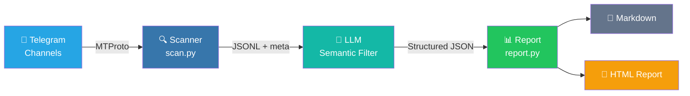

```
 _____ ____    ____ _   _    _    _   _ _   _ _____ _
|_   _/ ___|  / ___| | | |  / \  | \ | | \ | | ____| |
  | || |  _  | |   | |_| | / _ \ |  \| |  \| |  _| | |
  | || |_| | | |___|  _  |/ ___ \| |\  | |\  | |___| |___
  |_| \____|  \____|_| |_/_/   \_\_| \_|_| \_|_____|_____|
 ____   ____    _    _   _ _   _ _____ ____
/ ___| / ___|  / \  | \ | | \ | | ____|  _ \
\___ \| |     / _ \ |  \| |  \| |  _| | |_) |
 ___) | |___ / ___ \| |\  | |\  | |___|  _ <
|____/ \____/_/   \_\_| \_|_| \_|_____|_| \_\
```

[](https://www.python.org/downloads/)
[](LICENSE)
[](https://core.telegram.org/mtproto)
[](https://github.com/Sapientropic/tg-channel-scanner)

**Read Telegram channels → AI semantic filter → self-contained HTML report.**

One command scans dozens of channels, filters through your LLM, and generates a ranked digest. Job hunting, airdrop monitoring, news tracking — driven by plain-text profiles.

<p align="center"><a href="https://github.com/Sapientropic/tg-channel-scanner/releases/download/v1.0-demo/demo.mp4"></a></p>

<p align="center"><em>Click to play the full demo (56s)</em></p>

[**中文文档**](README.zh-CN.md)

---

## Quick Start

### Prerequisites

- Python 3.12+
- Telegram account (phone number)
- Telegram API credentials (`api_id` + `api_hash` from [my.telegram.org/apps](https://my.telegram.org/apps))

### Install

```bash
git clone https://github.com/Sapientropic/tg-channel-scanner.git
cd tg-channel-scanner
chmod +x setup.sh scripts/scan.sh
./setup.sh
```

### Configure & Run

```bash
# 1. Edit config with your Telegram API credentials
#    (setup.sh created it at ~/.config/tgcli/config.toml)
nano ~/.config/tgcli/config.toml

# 2. Scan channels (first run prompts for login)
source .venv/bin/activate
./scripts/scan.sh channel_lists/example.txt

# 3. Generate HTML report
python scripts/daily_report.py channel_lists/example.txt \
  --profile profiles/example.md --html
```

### Scan Options

```bash
# Past 24 hours (default)
./scripts/scan.sh channel_lists/example.txt

# Past 7 days
./scripts/scan.sh channel_lists/example.txt 168

# From a precise ISO-8601 cutoff
./scripts/scan.sh channel_lists/example.txt --since 2026-05-06T07:30:00Z
```

The scanner uses Telethon (MTProto) with `iter_messages` and early termination — it stops as soon as it hits a message older than your cutoff. No over-fetching.

<details>
<summary>Environment variables</summary>

```bash
SCAN_INITIAL_LIMIT=200   # initial read limit per channel
SCAN_MAX_LIMIT=5000      # hard cap before reporting incomplete
SCAN_DELAY=1             # seconds between channels
SCAN_MAX_FLOOD_WAIT_SECONDS=300
TG_SCANNER_CONFIG_DIR=~/.config/tgcli
```

</details>

### Export Channels from Telegram

```bash
python scripts/export_folder.py --list
python scripts/export_folder.py --folder "Jobs" --output channel_lists/jobs.txt
```

### Generate Reports

```bash
# Markdown + HTML report
python scripts/daily_report.py channel_lists/example.txt \
  --profile profiles/example.md --html

# Custom LLM endpoint (DeepSeek, Ollama, etc.)
python scripts/report.py --input output/scan_XXXX.jsonl \
  --profile profiles/example.md \
  --base-url https://api.deepseek.com/v1 --model deepseek-chat

# Redact contact info before sending to LLM
python scripts/report.py --input output/scan_XXXX.jsonl \
  --profile profiles/example.md --redact-contact-info

# Preview prompt without calling LLM
python scripts/report.py --input output/scan_XXXX.jsonl \
  --profile profiles/example.md --dry-run-prompt output/prompt-preview.md
```

<p align="center"></p>

<p align="center"></p>

The HTML report is a single self-contained file: OKLCH color coding (green/amber/gray), animated cards, expandable raw messages, and Telegram deep links.

<details>
<summary>Scheduling examples</summary>

```bash
# cron: every day at 09:00
0 9 * * * cd /path/to/tg-channel-scanner && .venv/bin/python scripts/daily_report.py channel_lists/example.txt --profile profiles/example.md
```

```bat
REM Windows Task Scheduler
cmd /c "cd /d C:\path\to\tg-channel-scanner && .venv\Scripts\python.exe scripts\daily_report.py channel_lists\example.txt --profile profiles\example.md"
```

</details>

<details>
<summary>Free-form AI summary & Media OCR</summary>

**Free-form summary** (no fixed layout, just a digest):

```bash
python scripts/summarize.py --input output/scan_XXXX.jsonl --profile profiles/example.md
```

**Media OCR/STT** (off by default):

```bash
# xAI vision
export XAI_API_KEY=your-key
./scripts/scan.sh channel_lists/example.txt --ocr --ocr-provider xai

# OpenAI vision
export OPENAI_API_KEY=sk-your-key
./scripts/scan.sh channel_lists/example.txt --ocr --ocr-provider openai

# Custom endpoint
./scripts/scan.sh channel_lists/example.txt --ocr --ocr-provider custom \
  --ocr-base-url http://localhost:11434/v1 --ocr-model your-vision-model
```

Use `--ocr-full-video` to extract frames from full videos (requires `ffmpeg`).

</details>

---

## How It Works



1. **Read** — Telethon reads messages from your subscribed channels
2. **Filter** — Precise timestamp cutoff with early termination
3. **Save** — JSONL + `.meta.json` sidecar
4. **Report** — LLM semantic matching → Python renders stats + Markdown/HTML

## Profiles & Channel Lists

### Profile

Copy `profiles/example.md` and edit:

```markdown
## Candidate
- Role: Frontend Developer
- Stack: React, TypeScript, Next.js
- Level: Middle/Senior
- Location: Remote preferred

## Filter Rules
- Only include jobs from last 24 hours
- Remove duplicates (same company + title)
- Exclude: Backend-only, Mobile, DevOps...
```

Custom modes (airdrops, news, events) add `## Extraction Schema`, `## Extraction Prompt`, and `## Report Labels` sections. See `profiles/example-airdrop.md`.

### Channel List

Create a `.txt` in `channel_lists/` with **Telegram usernames** (not display names), one per line:

```
remote_italic
dev_jobs_remote
react_jobs
```

> Find a channel's username: open in Telegram → tap name → look for @username.

Or export directly from Telegram: `python scripts/export_folder.py --folder "Jobs" --output channel_lists/jobs.txt`

## Directory Structure

```
tg-channel-scanner/
├── config.example.toml      # Template (actual config at ~/.config/tgcli/)
├── requirements.txt         # telethon
├── requirements-llm.txt     # optional summarizer deps
├── setup.sh / setup.bat     # One-command installer
├── profiles/                # Filter profiles
├── channel_lists/           # Channel name lists
├── scripts/
│   ├── scan.py              # Scanner core (Telethon)
│   ├── export_folder.py     # Export from Telegram folders
│   ├── report.py            # Report generator (Markdown + HTML)
│   ├── daily_report.py      # Scan + report pipeline
│   └── summarize.py         # Free-form LLM summary
├── templates/
│   ├── report-job.html      # OKLCH palette template
│   └── report-generic.html  # Custom mode template
├── output/                  # gitignored
└── docs/
    └── screenshots/         # Report screenshots
```

## Safety & Telegram ToS

- Reads only from channels you've subscribed to
- Respects `FloodWaitError` — no API abuse
- Use your real account, not a new/virtual number
- Do not use Telegram data for AI training, resale, or bulk harvesting

See [docs/tos-risk-analysis.md](docs/tos-risk-analysis.md) for details.

## Troubleshooting

| Problem | Fix |
|---------|-----|
| `ModuleNotFoundError: telethon` | `source .venv/bin/activate` |
| `.sh` scripts `Permission denied` | `chmod +x setup.sh scripts/scan.sh` |
| my.telegram.org shows ERROR | [docs/getting-api-credentials.md](docs/getting-api-credentials.md) |
| 0 messages collected | Check `output/*.errors.log` |
| Session expired | Delete `~/.config/tgcli/session`, re-run |

## License

MIT
