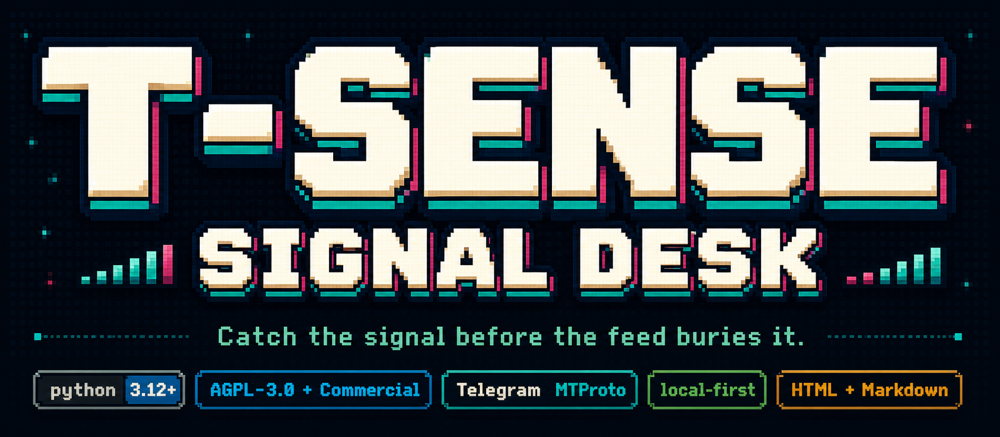
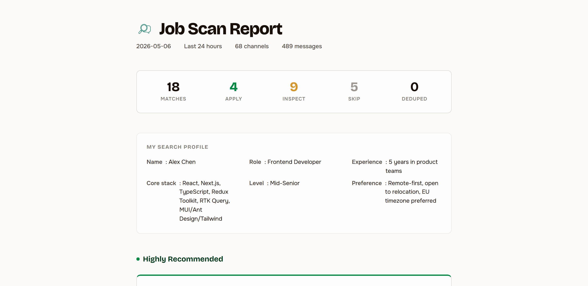
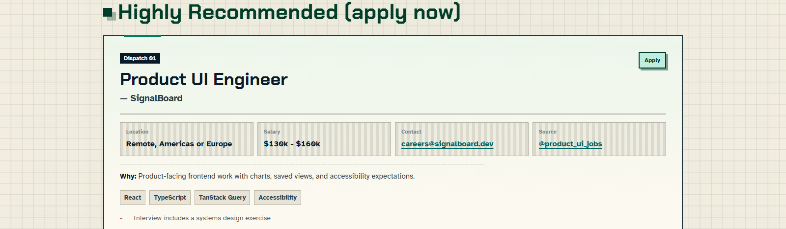
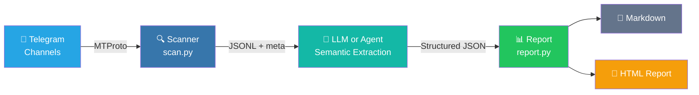

<div align="center">

<p>
  
</p>

<h3>Turn Telegram channel noise into a ranked daily signal report.</h3>

<p>
  <a href="https://www.python.org/downloads/"></a>
  <a href="LICENSE"></a>
  <a href="https://core.telegram.org/mtproto"></a>
  <a href="https://github.com/Sapientropic/tg-channel-scanner"></a>
  
</p>

<p><strong>Read subscribed channels -> apply a Markdown profile -> ship a self-contained HTML report.</strong></p>

<p>Built for job leads, airdrop watchlists, market/news tracking, and any Telegram workflow where the problem is too many channels and too little signal.</p>

<p>
  <a href="README.zh-CN.md"><strong>中文文档</strong></a>
  ·
  <a href="#demo"><strong>Demo</strong></a>
  ·
  <a href="#quick-start"><strong>Quick Start</strong></a>
  ·
  <a href="#report-output"><strong>Report Output</strong></a>
  ·
  <a href="ROADMAP.md"><strong>Roadmap</strong></a>
  ·
  <a href="#safety--telegram-tos"><strong>Safety</strong></a>
</p>

</div>

<table>
  <tr>
    <td align="center"><strong>Profile-driven</strong><br>Plain Markdown profiles define what counts as a match, reject, or follow-up.</td>
    <td align="center"><strong>Cutoff-aware</strong><br>Telethon reads through MTProto and stops as soon as messages fall outside your time window.</td>
    <td align="center"><strong>Report-ready</strong><br>Generate a single HTML file with semantic labels, source links, raw context, and stats.</td>
  </tr>
</table>

## Demo

<div align="center">

https://github.com/user-attachments/assets/d3a6fd44-7140-4843-86af-b32325abae33

</div>

<p align="center"><em>49s walkthrough preview. Source MP4: <a href="docs/demo.mp4">docs/demo.mp4</a>.</em></p>

---

## Quick Start

### Prerequisites

- Python 3.12+
- Telegram account (phone number)
- Telegram API credentials (`api_id` + `api_hash` from [my.telegram.org/apps](https://my.telegram.org/apps))

### Install

```bash
git clone https://github.com/Sapientropic/tg-channel-scanner.git
cd tg-channel-scanner
chmod +x setup.sh tgcs scripts/scan.sh
./setup.sh
```

### Configure & Run

```bash
# 0. Try the offline demo first (no Telegram login or LLM key required)
./tgcs demo

# 1. Edit config with your Telegram API credentials
#    (setup.sh created it at ~/.config/tgcli/config.toml)
nano ~/.config/tgcli/config.toml

# 2. Create local defaults and check first-run prerequisites
./tgcs init
./tgcs doctor

# 3. Complete Telegram login once
./tgcs login

# 4. Scan and generate today's HTML report
./tgcs run
```

On Windows, use `tgcs.bat` instead of `./tgcs`. The human facade defaults to
the `market-news` profile, `.tgcs/sources.json`, `output/`, HTML output, and
v0.4 local decision memory at `.tgcs/state`. Use `tgcs run --no-state` when
you need a stateless run.

### Agent-Native Mode

The repository also ships a root [SKILL.md](SKILL.md) and a structured
[agent CLI contract](docs/agent-cli-contract.md). The short `tgcs` command is
for humans. Agents should prefer the explicit JSON contract and the private
source registry at `.tgcs/sources.json`:

```bash
python scripts/source_registry.py import-list channel_lists/example.txt \
  --source-registry .tgcs/sources.json --format json

python scripts/doctor.py --source-registry .tgcs/sources.json \
  --profile profiles/templates/market-news.md --output-dir output --format json

python scripts/scan.py --source-registry .tgcs/sources.json --hours 24 \
  --output output/scan.jsonl --format json

python scripts/report.py --input output/scan.jsonl \
  --profile profiles/templates/market-news.md \
  --output output/report.md --html-output output/report.html \
  --source-registry .tgcs/sources.json --format json

# Optional v0.4 decision memory and feedback import
python scripts/report.py --input output/scan.jsonl \
  --profile profiles/templates/market-news.md \
  --items-json output/extracted-items.json \
  --output output/report.md --html-output output/report.html \
  --source-registry .tgcs/sources.json \
  --state-dir .tgcs/state \
  --feedback-jsonl output/report-feedback.jsonl \
  --format json
```

If no LLM provider key exists, `report.py --extractor auto` returns
`agent_extraction_required`; the agent can read the local extraction request,
write `semantic_items_v1`, then rerun `report.py` with `--items-json`.

Passing `--state-dir .tgcs/state` turns on local decision intelligence:
items are marked as new, seen, changed, recurring, or expired across runs.
The state file stores only item keys, source refs, counters, fingerprints,
rating history, and feedback counts. It does not store raw Telegram message
text or feedback note bodies.

### Scan Options

```bash
# Past 24 hours (default)
./scripts/scan.sh channel_lists/example.txt

# Past 7 days
./scripts/scan.sh channel_lists/example.txt 168

# From a precise ISO-8601 cutoff
./scripts/scan.sh channel_lists/example.txt --since 2026-05-06T07:30:00Z
```

The scanner uses Telethon (MTProto) with `iter_messages` and early termination — it stops as soon as it hits a message older than your cutoff. No over-fetching.

<details>
<summary>Environment variables</summary>

```bash
SCAN_INITIAL_LIMIT=200   # initial read limit per channel
SCAN_MAX_LIMIT=5000      # hard cap before reporting incomplete
SCAN_DELAY=1             # seconds between channels
SCAN_MAX_FLOOD_WAIT_SECONDS=300
TG_SCANNER_CONFIG_DIR=~/.config/tgcli
```

</details>

### Export Channels from Telegram

```bash
python scripts/export_folder.py --list
python scripts/export_folder.py --folder "Jobs" --output channel_lists/jobs.txt
```

### Generate Reports

```bash
# Human default: market-news + HTML + .tgcs/state
./tgcs run

# Human alternate profile
./tgcs run --profile jobs --hours 72

# Markdown + HTML report
python scripts/daily_report.py channel_lists/example.txt \
  --profile profiles/example.md --html

# Custom LLM endpoint (DeepSeek, Ollama, etc.)
# If only DEEPSEEK_API_KEY is set, these DeepSeek defaults are selected automatically.
python scripts/report.py --input output/scan_XXXX.jsonl \
  --profile profiles/example.md \
  --base-url https://api.deepseek.com/v1 --model deepseek-chat

# Redact contact info before sending to LLM
python scripts/report.py --input output/scan_XXXX.jsonl \
  --profile profiles/example.md --redact-contact-info

# Preview prompt without calling LLM
python scripts/report.py --input output/scan_XXXX.jsonl \
  --profile profiles/example.md --dry-run-prompt output/prompt-preview.md
```

## Report Output

The generated report is designed to be read as a decision surface: what matters, why it matched, where it came from, and whether it deserves action.

<table>
  <tr>
    <td align="center" width="50%">
      <br>
      <sub>Retro-pixel masthead, scan metadata, and dashboard counters.</sub>
    </td>
    <td align="center" width="50%">
      <br>
      <sub>Ranked cards with action labels, rationale, source chips, and raw message access.</sub>
    </td>
  </tr>
</table>

The HTML report is a single portable file with inline CSS, JS, and icon assets: premium retro-pixel styling, light/dark themes, dashboard counters, scroll-parallax cards, expandable raw messages, and Telegram deep links. Web fonts are an optional enhancement; system fallbacks keep the report readable offline.

<details>
<summary>Scheduling examples</summary>

```bash
# cron: every day at 09:00
0 9 * * * cd /path/to/tg-channel-scanner && .venv/bin/python scripts/daily_report.py channel_lists/example.txt --profile profiles/example.md
```

```bat
REM Windows Task Scheduler
cmd /c "cd /d C:\path\to\tg-channel-scanner && .venv\Scripts\python.exe scripts\daily_report.py channel_lists\example.txt --profile profiles\example.md"
```

</details>

<details>
<summary>Free-form AI summary & Media OCR</summary>

**Free-form summary** (no fixed layout, just a digest):

```bash
python scripts/summarize.py --input output/scan_XXXX.jsonl --profile profiles/example.md
```

**Media OCR/STT** (off by default):

```bash
# xAI vision
export XAI_API_KEY=your-key
./scripts/scan.sh channel_lists/example.txt --ocr --ocr-provider xai

# OpenAI vision
export OPENAI_API_KEY=sk-your-key
./scripts/scan.sh channel_lists/example.txt --ocr --ocr-provider openai

# Custom endpoint
./scripts/scan.sh channel_lists/example.txt --ocr --ocr-provider custom \
  --ocr-base-url http://localhost:11434/v1 --ocr-model your-vision-model
```

Video OCR is thumbnail-first by default, including standalone reprocessing with
`python scripts/ocr_media.py`. Use `--ocr-full-video` during scans, or
`--full-video` with `ocr_media.py`, only when you explicitly want full-video
processing. Full-video mode requires `ffmpeg` and can send extracted frames,
audio, or transcripts to the selected OCR/STT provider, so review privacy and
cost before enabling it.

</details>

---

## How It Works



1. **Read** — Telethon reads messages from your subscribed channels
2. **Filter** — Precise timestamp cutoff with early termination
3. **Save** — JSONL + `.meta.json` sidecar
4. **Report** — LLM or agent semantic extraction -> Python renders stats + Markdown/HTML

Data contract: each scanned message carries a stable `message_ref` (`channel` + `id`).
Reports ask the LLM for `source_message_refs` and use that channel-scoped key for raw
message lookup; `source_message_ids` is kept only for older JSONL/report compatibility.
The daily pipeline passes an explicit scan `--output` path into `report.py`, so a report
cannot silently reuse an older `scan_*.jsonl` from the output directory.
If no LLM key is configured, the same report flow can hand semantic extraction to the
calling agent through the local `agent_extraction_request_v1` / `semantic_items_v1`
contract documented in [docs/agent-cli-contract.md](docs/agent-cli-contract.md).

## Profiles & Channel Lists

### Profile

Start from a built-in template, or copy `profiles/example.md` for the legacy job-focused sample:

```bash
cp profiles/templates/jobs.md profiles/my-profile.md
cp profiles/templates/airdrops.md profiles/my-airdrops.md
cp profiles/templates/market-news.md profiles/my-market-news.md
```

Available templates: jobs, airdrops, market/news, research leads, and competitor monitoring.

Edit the copied profile:

```markdown
## Candidate
- Role: Frontend Developer
- Stack: React, TypeScript, Next.js
- Level: Middle/Senior
- Location: Remote preferred

## Filter Rules
- Only include jobs from last 24 hours
- Remove duplicates (same company + title)
- Exclude: Backend-only, Mobile, DevOps...
```

Custom modes (airdrops, news, events) add `## Extraction Schema`, `## Extraction Prompt`, and `## Report Labels` sections. See `profiles/example-airdrop.md`.

### Channel List

Create a `.txt` in `channel_lists/` with **Telegram usernames** (not display names), one per line:

```
remote_italic
dev_jobs_remote
react_jobs
```

> Find a channel's username: open in Telegram → tap name → look for @username.

Or export directly from Telegram: `python scripts/export_folder.py --folder "Jobs" --output channel_lists/jobs.txt`

### Source Registry

For agent-maintained source operations, prefer a private source registry over
editing channel lists in place. `.tgcs/` is gitignored by default, so real
source notes and priorities stay local:

```bash
python scripts/source_registry.py import-list channel_lists/example.txt \
  --source-registry .tgcs/sources.json --format json --dry-run

python scripts/source_registry.py import-list channel_lists/example.txt \
  --source-registry .tgcs/sources.json --format json

python scripts/source_registry.py list \
  --source-registry .tgcs/sources.json --format json
```

Legacy `channel_lists/*.txt` commands remain supported. See
[docs/source-registry.example.json](docs/source-registry.example.json) for the
schema shape.

## Directory Structure

```
tg-channel-scanner/
├── SKILL.md                 # Agent-facing operating guide
├── agents/openai.yaml       # Skill metadata for agent installers
├── tgcs / tgcs.bat          # Human-friendly command facade
├── config.example.toml      # Template (actual config at ~/.config/tgcli/)
├── requirements.txt         # telethon
├── requirements-llm.txt     # optional summarizer deps
├── setup.sh / setup.bat     # One-command installer
├── profiles/                # Filter profiles
│   └── templates/            # Built-in starter profiles
├── channel_lists/           # Channel name lists
├── scripts/
│   ├── agent_cli.py         # JSON envelope and exit-code helpers
│   ├── tgcs.py              # Human-friendly command facade implementation
│   ├── scan.py              # Scanner core (Telethon)
│   ├── source_registry.py   # Source registry import/list/export/validate
│   ├── export_folder.py     # Export from Telegram folders
│   ├── report.py            # Report generator (Markdown + HTML)
│   ├── report_diagnostics.py # Empty-result and scan-health diagnostics
│   ├── doctor.py            # First-run environment checks
│   ├── daily_report.py      # Scan + report pipeline
│   └── summarize.py         # Free-form LLM summary
├── templates/
│   ├── report-job.html      # Job report HTML shell
│   ├── report-generic.html  # Custom mode HTML shell
│   ├── report-shared.css    # Shared inline report styling
│   └── report-theme.js      # Shared inline theme/motion behavior
├── output/                  # gitignored
└── docs/
    ├── agent-cli-contract.md # Agent JSON contract and fallback schemas
    ├── demo.mp4             # Full product demo video, kept under 10 MB for GitHub uploads
    ├── demo/                # HyperFrames demo source and maintenance notes
    ├── licensing.md         # AGPL + commercial licensing policy
    ├── report-design-context.md  # Report UI design constraints
    └── screenshots/         # Report screenshots
```

## Safety & Telegram ToS

- Reads only from channels you've subscribed to
- Respects `FloodWaitError` — no API abuse
- Use your real account, not a new/virtual number
- Do not use Telegram data for AI training, resale, or bulk harvesting

See [docs/tos-risk-analysis.md](docs/tos-risk-analysis.md) for details.

## Troubleshooting

| Problem | Fix |
|---------|-----|
| `ModuleNotFoundError: telethon` | `source .venv/bin/activate` |
| `.sh` scripts `Permission denied` | `chmod +x setup.sh scripts/scan.sh` |
| my.telegram.org shows ERROR | [docs/getting-api-credentials.md](docs/getting-api-credentials.md) |
| 0 messages collected | Check `output/*.errors.log` |
| Session expired | Run `./tgcs login` again, or delete `~/.config/tgcli/session` and rerun |

## License

TG Channel Scanner is dual-licensed:

- Community License: `AGPL-3.0-only`
- Commercial License: available separately from Sapientropic

See [docs/licensing.md](docs/licensing.md) for community, commercial, hosted
service, and contribution rules.
