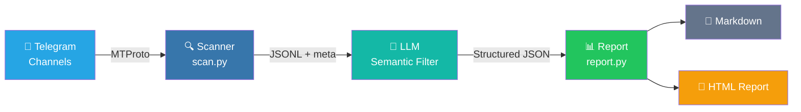

# TG Channel Scanner

[](https://www.python.org/downloads/)
[](LICENSE)
[](https://core.telegram.org/mtproto)
[](https://github.com/Sapientropic/tg-channel-scanner)

Read Telegram channel messages on demand, filter by keywords/profiles, and generate AI-powered digests.

Multi-mode: built-in job scanning mode plus profile-driven custom modes for any monitoring scenario (airdrops, news, events, etc.).

<p align="center">
  <video src="docs/demo.mp4" controls="controls" width="100%"></video>
</p>

[**中文文档**](README.zh-CN.md)

---

## Quick Start

### Prerequisites

- Python 3.12+
- Telegram account (phone number)
- Telegram API credentials (`api_id` + `api_hash` from [my.telegram.org/apps](https://my.telegram.org/apps))

### Install

```bash
git clone https://github.com/Sapientropic/tg-channel-scanner.git
cd tg-channel-scanner
chmod +x setup.sh scripts/scan.sh
./setup.sh
```

> `setup.sh` installs pinned dependencies from `requirements.txt` / `requirements-llm.txt` and verifies Telethon is available.

### Configure

```bash
# 1. Edit config with your Telegram API credentials
#    (setup.sh created it at ~/.config/tgcli/config.toml)
nano ~/.config/tgcli/config.toml

# 2. Run a scan (first run prompts for login if no session exists)
source .venv/bin/activate
./scripts/scan.sh channel_lists/example.txt
```

### Run a scan

```bash
# Scan all channels in a list, past 24 hours
./scripts/scan.sh channel_lists/example.txt

# Scan past 7 days
./scripts/scan.sh channel_lists/example.txt 168

# Scan since a precise ISO-8601 cutoff
./scripts/scan.sh channel_lists/example.txt --since 2026-05-06T07:30:00Z

# Output goes to output/scan_YYYYMMDD_HHMMSS.jsonl
# Metadata goes to output/scan_YYYYMMDD_HHMMSS.meta.json
# Errors go to output/scan_YYYYMMDD_HHMMSS.errors.log
```

The scanner reads messages via Telethon (MTProto user client) with a precise UTC cutoff. It uses `iter_messages` with early termination — as soon as it encounters a message older than the cutoff, it stops. This avoids over-fetching from high-volume channels. `SCAN_MAX_LIMIT` serves as a safety cap against runaway reads.

Useful environment variables:

```bash
SCAN_INITIAL_LIMIT=200   # initial read limit per channel
SCAN_MAX_LIMIT=5000      # hard cap before reporting incomplete
SCAN_DELAY=1             # seconds between channels
SCAN_MAX_FLOOD_WAIT_SECONDS=300  # fail the channel instead of sleeping longer
TG_SCANNER_CONFIG_DIR=~/.config/tgcli  # optional config/session directory override
```

### Export channels from a Telegram folder

If you organize channels into Telegram chat folders, you can export them directly:

```bash
# List all folders
python scripts/export_folder.py --list

# Export a folder by name
python scripts/export_folder.py --folder "Jobs" --output channel_lists/jobs.txt

# Export by folder ID (from --list)
python scripts/export_folder.py --folder-id 2 --output channel_lists/jobs.txt
```

The exported file works as a regular channel list for `scan.py`.

### Generate a report

Job mode (default) and custom mode are both driven by the profile. A job-mode profile produces a job scan report; a custom-mode profile produces a report with your own fields, schema, and labels.

```bash
# Job report (default)
export OPENAI_API_KEY=sk-your-key
python scripts/report.py --input output/scan_XXXX.jsonl --profile profiles/example.md \
  --output output/job-scan-report-2026-05-06.md

# Custom mode: airdrop monitor
python scripts/report.py --input output/scan_XXXX.jsonl --profile profiles/example-airdrop.md \
  --output output/airdrop-report-2026-05-06.md

# Optional: redact emails, phone numbers, and Telegram handles before sending
python scripts/report.py --input output/scan_XXXX.jsonl --profile profiles/example.md \
  --redact-contact-info

# Preview the exact extraction prompt without calling the LLM
python scripts/report.py --input output/scan_XXXX.jsonl --profile profiles/example.md \
  --dry-run-prompt output/prompt-preview.md

# Works with DeepSeek, Ollama, etc:
python scripts/report.py --input output/scan_XXXX.jsonl --profile profiles/example.md \
  --base-url https://api.deepseek.com/v1 --model deepseek-chat

# One command: scan then generate today's report
python scripts/daily_report.py channel_lists/example.txt --profile profiles/example.md

# Generate HTML report alongside Markdown (card layout, inline links, self-contained)
python scripts/daily_report.py channel_lists/example.txt --profile profiles/example.md --html
```

`report.py` sends selected messages and the profile to your configured OpenAI-compatible API. The LLM handles semantic matching; Python handles deduplication, statistics, and rendering. The extraction schema, system prompt, and report labels are all driven by the profile. For remote LLM providers, `--redact-contact-info` is recommended unless contact details are needed. Use `--dry-run-prompt` to review the exact payload before sending.

`daily_report.py` is a local convenience wrapper. It does not install a scheduler; use cron or Windows Task Scheduler if you want it to run daily.

### Report output

<p align="center">
  
</p>

<p align="center">
  
</p>

The HTML report is a single self-contained file with OKLCH color coding (green = apply, amber = investigate, gray = skip), animated card entrances, expandable raw messages, and Telegram deep links.

Daily scheduling examples:

```bash
# cron: run every day at 09:00
0 9 * * * cd /path/to/tg-channel-scanner && .venv/bin/python scripts/daily_report.py channel_lists/example.txt --profile profiles/example.md
```

```bat
REM Windows Task Scheduler action
cmd /c "cd /d C:\path\to\tg-channel-scanner && .venv\Scripts\python.exe scripts\daily_report.py channel_lists\example.txt --profile profiles\example.md"
```

### Free-form AI summary

```bash
python scripts/summarize.py --input output/scan_XXXX.jsonl --profile profiles/example.md

# Or feed output directly to Codex / Claude / any AI agent
#   Point your agent at:
#   - The JSONL scan file in output/
#   - Your profile in profiles/
#   Example Codex prompt:
#     "Read output/scan_XXXX.jsonl and filter jobs matching profiles/my-profile.md"
```

`summarize.py` remains available for a lightweight free-form digest when you do not need deterministic statistics or a fixed daily-report layout.

### Optional media OCR

Media OCR/STT is **off by default**. Enabling it downloads matching media to temporary files and uploads images, video thumbnails/frames, or voice audio to your configured OpenAI-compatible API.

```bash
# xAI vision default
export XAI_API_KEY=your-key
./scripts/scan.sh channel_lists/example.txt --ocr --ocr-provider xai

# OpenAI vision default
export OPENAI_API_KEY=sk-your-key
./scripts/scan.sh channel_lists/example.txt --ocr --ocr-provider openai

# Custom OpenAI-compatible endpoint
export OPENAI_API_KEY=your-key
./scripts/scan.sh channel_lists/example.txt --ocr --ocr-provider custom \
  --ocr-base-url http://localhost:11434/v1 --ocr-model your-vision-model
```

By default, video OCR uses the thumbnail only. `--ocr-full-video` downloads the full video and extracts frames; that mode requires `ffmpeg` and `ffprobe` on `PATH`.

---

## How It Works



1. **Read**: Telethon (MTProto user client) reads messages from channels you've subscribed to, including media metadata
2. **Filter**: `scripts/scan.py` filters by precise timestamp and refuses to silently accept saturated limits
3. **Save**: Messages are saved as JSONL with date, sender, text, channel info, media fields, and a `.meta.json` scan sidecar
4. **Report**: The LLM performs semantic matching using the extraction schema from your profile; Python renders deterministic stats and Markdown/HTML sections

## Directory Structure

```
tg-channel-scanner/
├── config.example.toml      # Template (actual config at ~/.config/tgcli/)
├── requirements.txt         # Pinned scanner dependency (telethon)
├── requirements-llm.txt     # Pinned optional summarizer dependency
├── requirements-dev.txt     # Pinned test dependency
├── setup.sh / setup.bat     # One-command installer
├── profiles/                # Filter profiles (job or custom mode)
│   ├── example.md           # Example: Frontend Developer job search
│   └── example-airdrop.md   # Example: Crypto airdrop monitor (custom mode)
├── channel_lists/           # Channel name lists (one per line)
│   └── example.txt          # Example channel list
├── scripts/
│   ├── scan.sh              # Batch channel reader (Mac/Linux)
│   ├── scan.bat             # Batch channel reader (Windows)
│   ├── scan.py              # Cross-platform scanner core (Telethon)
│   ├── export_folder.py     # Export channels from a Telegram chat folder
│   ├── media_ocr.py         # Shared OCR/STT helpers
│   ├── ocr_media.py         # Standalone OCR re-processor
│   ├── profile_schema.py    # Profile parser and mode configuration
│   ├── report.py            # Multi-mode report generator (Markdown + HTML)
│   ├── daily_report.py      # Scan + report convenience pipeline
│   └── summarize.py         # Optional LLM summarizer
├── templates/
│   ├── report-job.html      # HTML template for job mode (OKLCH palette)
│   ├── report-generic.html  # HTML template for custom modes
│   └── icon-job.png         # Report favicon/header icon
├── output/                  # Scan results (gitignored)
└── docs/
    ├── tos-risk-analysis.md
    └── getting-api-credentials.md
```

## Creating Your Own Profile

Copy `profiles/example.md` and edit the matching criteria. The profile tells the AI what to filter for:

```markdown
## Candidate
- Role: Frontend Developer
- Stack: React, TypeScript, Next.js
- Level: Middle/Senior
- Location: Remote preferred

## Filter Rules
- Only include jobs from last 24 hours
- Remove duplicates (same company + title)
- Exclude: Backend-only, Mobile, DevOps...
```

### Custom mode profiles

To use a custom mode (e.g. monitoring airdrops, news, events), add the optional `## Extraction Schema`, `## Extraction Prompt`, and `## Report Labels` sections to your profile. These override the built-in job-mode defaults. See `profiles/example-airdrop.md` for a complete example.

Key configuration sections:

| Section | What it controls |
|---------|-----------------|
| `## Extraction Schema` | Field definitions, dedup keys, top-level JSON key |
| `## Extraction Prompt` | System prompt, location/contact filter overrides |
| `## Report Labels` | Report title, section headers, output filename |

## Creating Your Own Channel List

Create a `.txt` file in `channel_lists/`. Use **Telegram channel usernames** (not display names), one per line:

```
# Good — these are Telegram usernames
remote_italic
dev_jobs_remote
react_jobs

# BAD — these are display names, won't work
React Job | JavaScript | Вакансии
```

> How to find a channel's username: open the channel in Telegram → tap the name → look for @username.

Lines starting with `#` are comments.

## Safety & Telegram ToS

This tool reads messages from channels you've already subscribed to. Use it for personal monitoring and keep the scan rate modest.

**Key points:**
- There is no project-level hard limit on channel count, but Telegram can rate-limit accounts
- On-demand and scheduled scans should respect `FloodWaitError`
- Use your real account (not a new/virtual number account)
- Do not use Telegram data for AI training, resale, redistribution, or bulk harvesting

Telegram's **FloodWaitError** is the normal rate-limit signal; account restrictions can still happen if the API is abused. See [docs/tos-risk-analysis.md](docs/tos-risk-analysis.md) for full details.

## Windows

```bat
setup.bat
```

This creates config at `%USERPROFILE%\.config\tgcli\config.toml` — edit it with your API credentials, then:

```bat
call .venv\Scripts\activate.bat
scripts\scan.bat channel_lists\example.txt
```

## Troubleshooting

| Problem | Fix |
|---------|-----|
| `ModuleNotFoundError: telethon` | Activate venv first: `source .venv/bin/activate` |
| `.sh` scripts `Permission denied` | `chmod +x setup.sh scripts/scan.sh` |
| my.telegram.org shows ERROR | See [docs/getting-api-credentials.md](docs/getting-api-credentials.md) |
| 0 messages collected | Check `output/*.errors.log` for failures |
| Scan exits with incomplete channel | Rare with iter_messages; raise `SCAN_MAX_LIMIT` if still hitting cap |
| Session expired / not authorized | Delete `~/.config/tgcli/session` and re-run; scan.py will prompt for login |
| OCR does not run | Pass `--ocr` explicitly and set `XAI_API_KEY` or `OPENAI_API_KEY` |

## License

MIT
