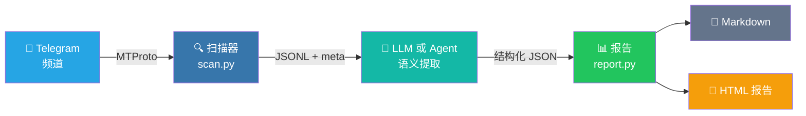

<div align="center">

<p>
  
</p>

<h3>把 Telegram 频道噪音变成可行动的每日信号报告。</h3>

<p>
  <a href="https://www.python.org/downloads/"></a>
  <a href="LICENSE"></a>
  <a href="https://core.telegram.org/mtproto"></a>
  <a href="https://github.com/Sapientropic/tg-channel-scanner"></a>
  
</p>

<p><strong>读取已订阅频道 -> 应用 Markdown Profile -> 生成自包含 HTML 报告。</strong></p>

<p>适合求职线索、空投监控、市场/新闻追踪，以及任何“频道太多、信号太少”的 Telegram 工作流。</p>

<p>
  <a href="README.md"><strong>English</strong></a>
  ·
  <a href="#演示"><strong>演示</strong></a>
  ·
  <a href="#快速开始"><strong>快速开始</strong></a>
  ·
  <a href="#报告输出"><strong>报告输出</strong></a>
  ·
  <a href="ROADMAP.md"><strong>路线图</strong></a>
  ·
  <a href="#安全与-telegram-tos"><strong>安全边界</strong></a>
</p>

</div>

<table>
  <tr>
    <td align="center"><strong>Profile 驱动</strong><br>用普通 Markdown 定义什么值得保留、拒绝或继续调查。</td>
    <td align="center"><strong>按时间截断</strong><br>通过 Telethon/MTProto 读取，遇到超过时间窗口的消息就停止。</td>
    <td align="center"><strong>报告可直接读</strong><br>生成单文件 HTML，包含语义标签、来源链接、原文上下文和统计信息。</td>
  </tr>
</table>

## 演示

<div align="center">

https://github.com/user-attachments/assets/d3a6fd44-7140-4843-86af-b32325abae33

</div>

<p align="center"><em>49 秒产品演示预览。源 MP4 见 <a href="docs/demo.mp4">docs/demo.mp4</a>。</em></p>

---

## 快速开始

### 前置条件

- Python 3.12+
- Telegram 账号（手机号）
- Telegram API 凭证（`api_id` + `api_hash`，[获取方法](docs/getting-api-credentials.md)）

### 安装并打开 Signal Desk

Windows 用户优先走 app 式入口：

1. 下载或 clone 仓库。
2. 双击 `Signal Desk.bat`。
3. 浏览器打开 Signal Desk 后，保持启动器窗口开着。

首次启动会自动准备本地虚拟环境、初始化 `.tgcs/` starter、构建 dashboard 资源，并打开
`127.0.0.1` 上的 Signal Desk。如果 8765 已经是兼容的 Signal Desk，会直接打开已有实例；如果
8765 被别的应用占用，会自动尝试 8766-8799。之后普通用户在 `Start` 和 `Settings` 里完成
setup、Telegram 登录、来源导入、dry-run、反馈导出、通知配置和 dry-run 自动化，不需要输入命令。

### 配置 & 运行

Signal Desk 的正常人类路径：

1. `Start`：先跑离线 demo，确认本机能生成报告。
2. `Start`：保存 Telegram API 凭证，发送登录验证码并完成登录。
3. `Settings -> Sources`：粘贴 Telegram 频道 handle 或 `t.me` 链接，预览后保存。
4. `Start`：跑一次 jobs-fast dry-run，不发送真实通知。
5. `Inbox / Runs`：阅读结果、处理卡片、打开本地报告。
6. `Settings -> Notifications`：填写 chat ID；Windows alpha 可在 Desk 内保存/清除 bot token 到 Windows Credential Manager。

<details>
<summary>Expert / agent CLI fallback</summary>

```bash
git clone https://github.com/Sapientropic/tg-channel-scanner.git
cd tg-channel-scanner
chmod +x setup.sh tgcs scripts/scan.sh
./setup.sh
./tgcs dashboard --open
```

CLI 仍适合 agent、自动化和排障。人类默认不要从编辑 TOML、复制命令或手填环境变量开始。

</details>

### v0.5-alpha Monitor 与 Inbox

v0.5-alpha monitor 保留 agent/专家可用的 CLI JSON 合同，同时把普通用户路径前移到 Signal Desk：

```bash
# 写入可编辑的 .tgcs/profiles.toml
./tgcs monitor init-config

# 如果目标就是开发者机会快讯，可直接用 jobs starter 初始化
# 已有 .tgcs/sources.json 会被保留，并增量合并 jobs topic 标记。
./tgcs init --starter jobs

# 查看 jobs starter 当前唯一下一步
./tgcs quickstart jobs

# 跑一个 profile；dry-run delivery 是安全默认值
./tgcs monitor run --profile-id market-news --delivery-mode dry-run

# 开发者机会快讯：用 Task Scheduler/cron 每 15 分钟调用一次
./tgcs monitor run --profile-id jobs-fast --delivery-mode live

# 把真实机会频道导入 jobs-fast 链路
./tgcs sources import channel_lists/jobs.txt --topic jobs

# 只查看或导出某条 profile lane 的来源
./tgcs sources list --topic jobs
./tgcs sources export --topic jobs --output output/jobs-sources.txt

# 只打印计划任务命令，不自动安装
./tgcs schedule print --profile-id jobs-fast --interval-minutes 15 --delivery-mode live

# 专家 fallback：启动本地 dashboard；首次运行会自动构建 dashboard/dist
./tgcs dashboard

# 把 dashboard 里已处理的决策导出为可复用反馈
./tgcs feedback export
```

Monitor run 会把 artifact 写到 `output/runs/<run_id>/`，更新
`run_manifest_v1`，并把 dashboard 状态写入 `.tgcs/tgcs.db`。高优先级 new /
changed 项会成为 alert candidate 和 pending review card。Telegram Bot delivery
的 token 解析顺序是：环境变量 `TGCS_TELEGRAM_BOT_TOKEN` 优先，其次是 Signal Desk
在 Windows Credential Manager 保存的本机 token。token 不写入 SQLite、manifest、
报告或文档，也不会回显到 UI。macOS/Linux keychain 暂不纳入本轮 alpha 完成口径，
界面会标记 `[⚠️ 需确认]`，继续保留 expert/env 边界。

内置 `jobs-fast` monitor 把开发者机会快讯和 24 小时审计日报拆开：默认扫描 2 小时
容错窗口，但只对最近 60 分钟内的高优先级 new / changed 职位、合同、接活或 Mini Apps/TON 项目打断提醒。高频路径
会先做本地关键词预过滤；没有机会信号关键词时直接跳过 report/LLM 阶段。Dashboard
可以把每个 profile 切到白天提醒、全天提醒或静音，并在 Sources 的 evidence 区里复盘哪些招聘频道有新鲜消息、真正产出高价值线索、需要继续观察，或可考虑清理。
真实机会频道建议在 Signal Desk `Settings -> Sources` 里粘贴导入；专家 fallback 是 `./tgcs sources import <channel-list> --topic jobs`；
导入时也会给已存在的同名来源补上 topic，避免 `jobs-fast` 的 topic 过滤继续落到
占位示例来源。

`./tgcs doctor` 也会检查 dashboard 静态资源是否已构建。资源缺失只会给 warning，
因为本机有 Node/npm 时 `./tgcs dashboard` 会在首次启动时自动构建。

Dashboard 里的 keep / skip / false-positive 决策可以在 Settings 里导出，也可以通过
`./tgcs feedback export` 导出为不含私密 note 的 `tgcs-feedback-v1` JSONL，再通过
`--feedback-jsonl output/dashboard-feedback.jsonl` 复用到本地决策记忆链路。
最新运行已有待处理卡片时，首屏直接进入队列和 triage 控件；没有最新行动卡片时，
board 才显示紧凑运行摘要：一个人工可读的 profile 任务名、一个 action / all-clear /
source-fix 判断，以及 scanned -> matched -> cards -> action 漏斗，不再在 Inbox
上方重复完整报告或 Top 3 卡片文案。Runs 页也可以通过本地 artifact 路由打开生成报告；
服务端只允许读取 workspace 内 `runs/` 目录下的报告 HTML / Markdown 文件。
Dashboard 状态会把 runs 投影成计数、健康状态、任务标签和一个报告 artifact，也会把
profiles 投影成展示标签与告警/来源限制；raw scan artifact、完整 profile config、
registry 路径、hash 和 error 文件仍留在本地 manifest 里调试。Dashboard 的默认信息架构
也按 ADHD 复用场景收紧：顶部指标是紧凑 readout，Repository 操作只在 Settings，
Inbox 用 triage 分布条，Runs 用固定七日健康图和有限 evidence ledger，而不是无限增长的
run cell 或重复报告标题。

高频打断链路默认把语义抽取限制在 20 条命中消息和 2000 输出 tokens 内；更大的
时间窗口和穷尽式复盘继续交给 24 小时审计 / backfill 链路。
`./tgcs schedule print` 只打印 Windows Task Scheduler 或 cron 命令供你确认，
不会自动创建系统计划任务。

未配置 `OPENAI_API_KEY` 且存在 `DEEPSEEK_API_KEY` 时，语义抽取默认使用
`deepseek-v4-flash`，关闭 thinking，并请求 JSON 输出；即使同时配置 MiniMax，
默认高频链路也优先 DeepSeek。MiniMax M2.7 也可走官方 OpenAI-compatible endpoint：
Token Plan key 用 `MINIMAX_TOKEN_PLAN_KEY`，标准 platform key 用
`MINIMAX_API_KEY`。Token Plan key 默认走中国区 endpoint
`https://api.minimaxi.com/v1`；标准 platform key 默认走
`https://api.minimax.io/v1`。如果账号需要显式覆盖 endpoint，设置
`MINIMAX_BASE_URL`。可以用本地 eval 在历史消息上比较 provider 延迟、JSON
稳定性和聚合 token usage；eval artifact 不复制 Telegram 原文，workspace 内路径
写相对路径，workspace 外路径只保留文件名；只有外部文件同名会追加短 hash 防撞：

```bash
python scripts/eval_deepseek_cache.py --sample-size 20 --repeat 3 --format json
python scripts/eval_deepseek_cache.py --sample-sizes 10,20,30 \
  --models deepseek-v4-flash,MiniMax-M2.7 --repeat 1 --max-tokens 1000 --format json
```

### Agent 原生模式

仓库根目录提供 [SKILL.md](SKILL.md) 和结构化
[agent CLI 合同](docs/agent-cli-contract.md)。短命令 `tgcs` 给人类使用；agent 调用时优先使用
显式 JSON 合同和私有 source registry（默认 `.tgcs/sources.json`）：

```bash
python scripts/source_registry.py import-list channel_lists/example.txt \
  --source-registry .tgcs/sources.json --format json

python scripts/source_registry.py import-list channel_lists/jobs.txt \
  --source-registry .tgcs/sources.json --topic jobs --format json

python scripts/doctor.py --source-registry .tgcs/sources.json \
  --profile profiles/templates/market-news.md --output-dir output --format json

python scripts/scan.py --source-registry .tgcs/sources.json --hours 24 \
  --output output/scan.jsonl --format json

python scripts/report.py --input output/scan.jsonl \
  --profile profiles/templates/market-news.md \
  --output output/report.md --html-output output/report.html \
  --source-registry .tgcs/sources.json --format json

# 可选：启用 v0.4 本地决策记忆并导入反馈
python scripts/report.py --input output/scan.jsonl \
  --profile profiles/templates/market-news.md \
  --items-json output/extracted-items.json \
  --output output/report.md --html-output output/report.html \
  --source-registry .tgcs/sources.json \
  --state-dir .tgcs/state \
  --feedback-jsonl output/report-feedback.jsonl \
  --format json

# 可选：v0.5-alpha monitor 状态、manifest、inbox 和 alert events
python scripts/monitor.py run --profile-id market-news \
  --delivery-mode dry-run --format json

python scripts/monitor.py feedback-export \
  --db .tgcs/tgcs.db --output output/dashboard-feedback.jsonl --format json
```

如果本机没有 LLM provider key，`report.py --extractor auto` 会返回
`agent_extraction_required`；agent 读取本地 extraction request，写出
`semantic_items_v1`，再用 `--items-json` 重跑 `report.py`。

传入 `--state-dir .tgcs/state` 会启用本地 decision intelligence：报告会跨运行标记
new、seen、changed、recurring、expired。状态文件只保存 item key、source refs、
计数、fingerprint、rating history 和反馈计数，不保存 Telegram 原文或反馈 note 正文。

### 扫描选项

```bash
# 过去 24 小时（默认）
./scripts/scan.sh channel_lists/example.txt

# 过去 7 天
./scripts/scan.sh channel_lists/example.txt 168

# 从精确 ISO-8601 时间点
./scripts/scan.sh channel_lists/example.txt --since 2026-05-06T07:30:00Z
```

扫描器使用 Telethon（MTProto）+ `iter_messages` 流式读取，遇到超过 cutoff 的消息立刻停止，不会过度拉取。

<details>
<summary>环境变量</summary>

```bash
SCAN_INITIAL_LIMIT=200   # 每个频道初始读取 limit
SCAN_MAX_LIMIT=5000      # 硬上限
SCAN_DELAY=1             # 频道间等待秒数
SCAN_MAX_FLOOD_WAIT_SECONDS=300
TG_SCANNER_CONFIG_DIR=~/.config/tgcli
```

</details>

### 从 Telegram 导出频道

```bash
python scripts/export_folder.py --list
python scripts/export_folder.py --folder "Jobs" --output channel_lists/jobs.txt
```

### 生成报告

```bash
# 人类默认入口：market-news + HTML + .tgcs/state
./tgcs run

# 人类入口也可以换 profile 和时间窗口
./tgcs run --profile jobs --hours 72

# Markdown + HTML 报告
python scripts/daily_report.py channel_lists/example.txt \
  --profile profiles/example.md --html

# 自定义 LLM 端点（DeepSeek、Ollama 等）
# 如果只设置了 DEEPSEEK_API_KEY，report.py 会自动使用 DeepSeek 默认端点和模型。
python scripts/report.py --input output/scan_XXXX.jsonl \
  --profile profiles/example.md \
  --base-url https://api.deepseek.com/v1 --model deepseek-chat

# 脱敏后再发给 LLM
python scripts/report.py --input output/scan_XXXX.jsonl \
  --profile profiles/example.md --redact-contact-info

# 预览 prompt 不调用 LLM
python scripts/report.py --input output/scan_XXXX.jsonl \
  --profile profiles/example.md --dry-run-prompt output/prompt-preview.md
```

## 报告输出

生成的报告不是日志堆叠，而是一个决策界面：哪些内容重要、为什么命中、来自哪里、是否值得行动。

<table>
  <tr>
    <td align="center" width="50%">
      <br>
      <sub>复古像素 Masthead、扫描元信息和仪表盘统计。</sub>
    </td>
    <td align="center" width="50%">
      <br>
      <sub>排序卡片、行动标签、匹配理由、来源 chips 和原文展开。</sub>
    </td>
  </tr>
</table>

HTML 报告是单个便携文件，内联 CSS、JS 和图标资产：高级复古像素风、日夜主题、仪表盘统计、滚动视差卡片、可展开原文和 Telegram 深链接。Web 字体只是增强项，离线时会回退到系统字体。

<details>
<summary>定时任务示例</summary>

```bash
# cron：每天 09:00
0 9 * * * cd /path/to/tg-channel-scanner && .venv/bin/python scripts/daily_report.py channel_lists/example.txt --profile profiles/example.md
```

```bat
REM Windows Task Scheduler
cmd /c "cd /d C:\path\to\tg-channel-scanner && .venv\Scripts\python.exe scripts\daily_report.py channel_lists\example.txt --profile profiles\example.md"
```

</details>

<details>
<summary>自由格式 AI 摘要 & Media OCR</summary>

**自由格式摘要**（无固定排版，纯摘要）：

```bash
python scripts/summarize.py --input output/scan_XXXX.jsonl --profile profiles/example.md
```

**Media OCR/STT**（默认关闭）：

```bash
# xAI vision
export XAI_API_KEY=your-key
./scripts/scan.sh channel_lists/example.txt --ocr --ocr-provider xai

# OpenAI vision
export OPENAI_API_KEY=sk-your-key
./scripts/scan.sh channel_lists/example.txt --ocr --ocr-provider openai

# 自定义端点
./scripts/scan.sh channel_lists/example.txt --ocr --ocr-provider custom \
  --ocr-base-url http://localhost:11434/v1 --ocr-model your-vision-model
```

视频 OCR 默认只走缩略图，独立重处理命令 `python scripts/ocr_media.py` 也是如此。
只有明确需要完整视频处理时，扫描命令才使用 `--ocr-full-video`，独立命令才使用
`--full-video`。完整视频模式需要 `ffmpeg`，并可能把提取的视频帧、音频或转写文本
发送给所选 OCR/STT provider；开启前先确认隐私和成本边界。

</details>

---

## 工作原理



1. **读取** — Telethon 读取已订阅频道消息
2. **过滤** — 精确时间截断 + 提前终止
3. **保存** — JSONL + `.meta.json`
4. **报告** — LLM 或 agent 语义提取 -> Python 渲染统计 + Markdown/HTML

数据合同：每条扫描消息都会带稳定 `message_ref`（`channel` + `id`）。报告要求
LLM 输出 `source_message_refs`，并用这个按频道限定的 key 查原文；`source_message_ids`
只保留作旧 JSONL/旧报告兼容。每日流水线会把本轮 scan 的明确 `--output` 路径传给
`report.py`，不会静默复用输出目录里的旧 `scan_*.jsonl`。
如果没有配置 LLM key，同一报告流程会通过本地
`agent_extraction_request_v1` / `semantic_items_v1` 合同把语义提取交给调用它的
agent。完整合同见 [docs/agent-cli-contract.md](docs/agent-cli-contract.md)。

## Profile 与频道列表

### Profile

优先从内置模板复制，也可以继续使用旧的求职示例 `profiles/example.md`：

```bash
cp profiles/templates/jobs.md profiles/my-profile.md
cp profiles/templates/airdrops.md profiles/my-airdrops.md
cp profiles/templates/market-news.md profiles/my-market-news.md
```

当前模板覆盖：求职、空投、市场/新闻、研究线索、竞品监控。

然后编辑复制出的 profile：

```markdown
## 候选人
- 目标岗位：前端工程师
- 技术栈：React, TypeScript, Next.js
- 级别：Middle/Senior
- 工作方式：远程优先

## 筛选规则
- 只包含过去 24 小时内的职位
- 去重（同公司 + 同岗位）
- 排除：纯后端、移动端、DevOps...
```

自定义模式（空投、新闻、活动）添加 `## Extraction Schema`、`## Extraction Prompt`、`## Report Labels` 即可。见 `profiles/example-airdrop.md`。

### 频道列表

在 `channel_lists/` 下创建 `.txt`，使用 **Telegram 用户名**（不是显示名），每行一个：

```
remote_italic
dev_jobs_remote
react_jobs
```

> 获取用户名：Telegram 打开频道 → 点击名称 → 查看 @username。

或直接导出：`python scripts/export_folder.py --folder "Jobs" --output channel_lists/jobs.txt`

### Source Registry

需要让 agent 长期维护来源时，优先使用私有 source registry，而不是直接反复改
channel list。`.tgcs/` 默认已 gitignore，真实来源备注和优先级只保留在本地：

```bash
python scripts/source_registry.py import-list channel_lists/example.txt \
  --source-registry .tgcs/sources.json --format json --dry-run

python scripts/source_registry.py import-list channel_lists/example.txt \
  --source-registry .tgcs/sources.json --format json

python scripts/source_registry.py list \
  --source-registry .tgcs/sources.json --format json
```

旧的 `channel_lists/*.txt` 命令仍然可用。Schema 形状见
[docs/source-registry.example.json](docs/source-registry.example.json)。

## 目录结构

```
tg-channel-scanner/
├── SKILL.md                 # agent 调用指南
├── agents/openai.yaml       # skill 安装元数据
├── tgcs / tgcs.bat          # 人类友好的短命令入口
├── config.example.toml      # 配置模板（实际配置在 ~/.config/tgcli/）
├── requirements.txt         # telethon
├── requirements-llm.txt     # 可选摘要依赖
├── setup.sh / setup.bat     # 一键安装
├── dashboard/               # 可选 Vite React 本地 dashboard
├── profiles/                # 筛选 profile
│   └── templates/            # 内置 starter profiles
├── channel_lists/           # 频道名称列表
├── scripts/
│   ├── agent_cli.py         # JSON envelope 和退出码 helper
│   ├── tgcs.py              # 人类短命令 facade 实现
│   ├── scan.py              # 扫描核心（Telethon）
│   ├── source_registry.py   # source registry 导入/列出/导出/校验
│   ├── export_folder.py     # 从 Telegram 文件夹导出
│   ├── report.py            # 报告生成器（Markdown + HTML）
│   ├── report_diagnostics.py # 空结果与扫描健康诊断
│   ├── doctor.py            # first-run 环境检查
│   ├── daily_report.py      # 扫描 + 报告流水线
│   ├── monitor.py           # v0.5-alpha profile monitor runner
│   ├── monitor_state.py     # inbox/alert/profile diff 的 SQLite 状态
│   ├── delivery.py          # delivery adapters
│   ├── dashboard_server.py  # localhost dashboard API/静态服务
│   └── summarize.py         # 自由格式摘要
├── templates/
│   ├── report-job.html      # 求职报告 HTML 壳
│   ├── report-generic.html  # 自定义模式 HTML 壳
│   ├── report-shared.css    # 内联共享样式
│   └── report-theme.js      # 内联主题与动效逻辑
├── output/                  # 已 gitignore
└── docs/
    ├── agent-cli-contract.md # Agent JSON 合同与 fallback schema
    ├── demo.mp4             # 完整产品演示视频，控制在 10 MB 内便于 GitHub 上传
    ├── demo/                # HyperFrames 演示源码和维护说明
    ├── licensing.md         # AGPL + 商业授权策略
    ├── report-design-context.md  # 报告 UI 设计约束
    └── screenshots/         # 报告截图
```

## 安全与 Telegram ToS

- 只读取你已订阅的频道
- 尊重 `FloodWaitError`，不滥用 API
- 使用真实账号，非新建/虚拟号
- 不要将 Telegram 数据用于 AI 训练、转售或批量采集

详见 [docs/tos-risk-analysis.md](docs/tos-risk-analysis.md)。

## 常见问题

| 问题 | 解决 |
|------|------|
| `ModuleNotFoundError: telethon` | `source .venv/bin/activate` |
| `.sh` 脚本 `Permission denied` | `chmod +x setup.sh scripts/scan.sh` |
| my.telegram.org 显示 ERROR | [获取凭证指南](docs/getting-api-credentials.md) |
| 扫描到 0 条消息 | 检查 `output/*.errors.log` |
| Session 过期 | 重新运行 `./tgcs login`，或删除 `~/.config/tgcli/session` 后再登录 |

## 许可证

TG Channel Scanner 采用双授权：

- 社区版：`AGPL-3.0-only`
- 商业授权：由 Sapientropic 单独授权

社区版、商业版、托管服务和贡献规则见 [docs/licensing.md](docs/licensing.md)。
