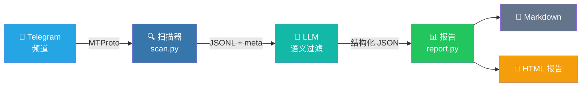

# TG 频道扫描器

[](https://www.python.org/downloads/)
[](LICENSE)
[](https://core.telegram.org/mtproto)
[](https://github.com/Sapientropic/tg-channel-scanner)

按需读取 Telegram 频道消息，按 profile 过滤，生成 AI 摘要报告。

多模式支持：内置求职扫描模式，同时支持 profile 驱动的自定义模式（空投监控、新闻追踪、活动筛选等）。

<p align="center">
  <video src="docs/demo.mp4" controls="controls" width="100%"></video>
</p>

[**English**](README.md)

---

## 快速开始

### 前置条件

- Python 3.12+
- Telegram 账号（手机号）
- Telegram API 凭证（`api_id` + `api_hash`，[获取方法](docs/getting-api-credentials.md)）

### 安装

```bash
git clone https://github.com/Sapientropic/tg-channel-scanner.git
cd tg-channel-scanner
chmod +x setup.sh scripts/scan.sh
./setup.sh
```

> `setup.sh` 会从 `requirements.txt` / `requirements-llm.txt` 安装锁定依赖，并验证 Telethon 可用。

### 配置

```bash
# 1. 编辑配置，填入 Telegram API 凭证
#    （setup.sh 已创建 ~/.config/tgcli/config.toml）
nano ~/.config/tgcli/config.toml

# 2. 运行扫描（首次运行如无 session 会自动引导登录）
source .venv/bin/activate
./scripts/scan.sh channel_lists/example.txt
```

### 运行扫描

```bash
# 扫描频道列表中所有频道，过去 24 小时
./scripts/scan.sh channel_lists/example.txt

# 扫描过去 7 天
./scripts/scan.sh channel_lists/example.txt 168

# 从精确 ISO-8601 时间点开始扫描
./scripts/scan.sh channel_lists/example.txt --since 2026-05-06T07:30:00Z

# 输出保存到 output/scan_YYYYMMDD_HHMMSS.jsonl
# 元数据保存到 output/scan_YYYYMMDD_HHMMSS.meta.json
# 错误日志在 output/scan_YYYYMMDD_HHMMSS.errors.log
```

扫描器通过 Telethon（MTProto user client）读取消息，使用精确 UTC cutoff。采用 `iter_messages` 流式读取 + 时间截断——遇到超过 cutoff 的消息立刻停止，避免从高流量频道过度拉取。`SCAN_MAX_LIMIT` 作为安全上限防止失控读取。

常用环境变量：

```bash
SCAN_INITIAL_LIMIT=200   # 每个频道初始读取 limit
SCAN_MAX_LIMIT=5000      # 达到该上限仍饱和则报 incomplete
SCAN_DELAY=1             # 频道之间等待秒数
SCAN_MAX_FLOOD_WAIT_SECONDS=300  # 超过该 FloodWait 秒数就让该频道失败
TG_SCANNER_CONFIG_DIR=~/.config/tgcli  # 可选：配置和 session 目录
```

### 从 Telegram 文件夹导出频道

如果你在 Telegram 里用聊天文件夹整理频道，可以直接导出：

```bash
# 列出所有文件夹
python scripts/export_folder.py --list

# 按名称导出
python scripts/export_folder.py --folder "Jobs" --output channel_lists/jobs.txt

# 按 ID 导出（从 --list 获取）
python scripts/export_folder.py --folder-id 2 --output channel_lists/jobs.txt
```

导出的文件可直接用于 `scan.py`。

### 生成报告

求职模式（默认）和自定义模式都由 profile 驱动。求职 profile 生成职位扫描报告；自定义 profile 用你自己的字段、schema 和标签生成报告。

```bash
# 稳定日报：LLM 做职位语义判断，Python 负责统计和 Markdown 模板
export OPENAI_API_KEY=sk-your-key
python scripts/report.py --input output/scan_XXXX.jsonl --profile profiles/example.md \
  --output output/job-scan-report-2026-05-06.md

# 可选：发送给 LLM 前脱敏邮箱、手机号和 Telegram handle
python scripts/report.py --input output/scan_XXXX.jsonl --profile profiles/example.md \
  --redact-contact-info

# 只预览将发送给 LLM 的抽取 prompt，不发起 API 请求
python scripts/report.py --input output/scan_XXXX.jsonl --profile profiles/example.md \
  --dry-run-prompt output/prompt-preview.md

# 兼容 DeepSeek、Ollama 等：
python scripts/report.py --input output/scan_XXXX.jsonl --profile profiles/example.md \
  --base-url https://api.deepseek.com/v1 --model deepseek-chat

# 一条命令：先扫描，再生成今天的日报
python scripts/daily_report.py channel_lists/example.txt --profile profiles/example.md

# 同时生成 HTML 报告（卡片布局，内联链接，单文件可移植）
python scripts/daily_report.py channel_lists/example.txt --profile profiles/example.md --html
```

`report.py` 会把选中的消息和 profile 发送到你配置的 OpenAI-compatible API。LLM 负责语义筛选；Python 负责去重、统计和渲染。提取 schema、系统提示词和报告标签都由 profile 驱动。使用远程 LLM 时，推荐先用 `--dry-run-prompt` 审查 payload；除非确实需要保留联系人信息，否则可以加 `--redact-contact-info`。

`daily_report.py` 只是本地便利入口，不会创建系统定时任务。需要每天自动运行时，请用 cron 或 Windows Task Scheduler 调用它。

### 报告效果

<p align="center">
  
</p>

<p align="center">
  
</p>

HTML 报告为单文件自包含格式，使用 OKLCH 色标（绿色=申请、琥珀色=调查、灰色=跳过）、卡片入场动画、可展开原文和 Telegram 深链接。

定时示例：

```bash
# cron：每天 09:00 运行
0 9 * * * cd /path/to/tg-channel-scanner && .venv/bin/python scripts/daily_report.py channel_lists/example.txt --profile profiles/example.md
```

```bat
REM Windows Task Scheduler 的 action
cmd /c "cd /d C:\path\to\tg-channel-scanner && .venv\Scripts\python.exe scripts\daily_report.py channel_lists\example.txt --profile profiles\example.md"
```

### 自由格式 AI 摘要

```bash
python scripts/summarize.py --input output/scan_XXXX.jsonl --profile profiles/example.md

# 也可以直接把输出文件交给 Codex / Claude / 任何 AI agent
#   把以下两个文件路径给 agent：
#   - output/ 中的 JSONL 扫描文件
#   - profiles/ 中的 profile 文件
#   Codex 示例 prompt：
#     "Read output/scan_XXXX.jsonl and filter jobs matching profiles/my-profile.md"
```

`summarize.py` 继续保留，适合不需要固定日报结构和可复现统计的轻量自由摘要。

### 可选 media OCR

Media OCR/STT 默认关闭。开启后，脚本会把匹配消息中的图片、视频缩略图/帧或语音下载到临时文件，并发送到你配置的 OpenAI-compatible API。

```bash
# xAI vision 默认
export XAI_API_KEY=your-key
./scripts/scan.sh channel_lists/example.txt --ocr --ocr-provider xai

# OpenAI vision 默认
export OPENAI_API_KEY=sk-your-key
./scripts/scan.sh channel_lists/example.txt --ocr --ocr-provider openai

# 自定义 OpenAI-compatible endpoint
export OPENAI_API_KEY=your-key
./scripts/scan.sh channel_lists/example.txt --ocr --ocr-provider custom \
  --ocr-base-url http://localhost:11434/v1 --ocr-model your-vision-model
```

默认视频 OCR 只使用缩略图。`--ocr-full-video` 会下载完整视频并抽帧，这个模式要求 `ffmpeg` 和 `ffprobe` 已在 `PATH` 中。

---

## 工作原理



1. **读取**：Telethon（MTProto user client）读取你已订阅频道的消息，包括图片等 media 元数据
2. **过滤**：`scripts/scan.py` 按精确时间过滤，并拒绝静默接受已打满的读取上限
3. **保存**：消息保存为 JSONL，包含日期、发送者、文本、频道信息、media 字段，并同步写 `.meta.json`
4. **报告**：LLM 按 profile 中的提取 schema 做语义匹配；Python 渲染可复现的统计和 Markdown/HTML 报告

## 目录结构

```
tg-channel-scanner/
├── config.example.toml      # 配置模板（实际配置在 ~/.config/tgcli/）
├── requirements.txt         # 锁定 scanner 依赖（telethon）
├── requirements-llm.txt     # 锁定可选摘要依赖
├── requirements-dev.txt     # 锁定测试依赖
├── setup.sh / setup.bat     # 一键安装脚本
├── profiles/                # 筛选 profile（求职或自定义模式）
│   ├── example.md           # 示例：前端工程师求职
│   └── example-airdrop.md   # 示例：加密空投监控（自定义模式）
├── channel_lists/           # 频道名称列表（每行一个）
│   └── example.txt          # 示例频道列表
├── scripts/
│   ├── scan.sh              # 批量频道读取（Mac/Linux）
│   ├── scan.bat             # 批量频道读取（Windows）
│   ├── scan.py              # 跨平台扫描核心（Telethon）
│   ├── export_folder.py     # 从 Telegram 聊天文件夹导出频道列表
│   ├── media_ocr.py         # 共享 OCR/STT helper
│   ├── ocr_media.py         # 独立 OCR 重新处理脚本
│   ├── profile_schema.py    # Profile 解析器和模式配置
│   ├── report.py            # 多模式报告生成器（Markdown + HTML）
│   ├── daily_report.py      # 扫描 + 报告便利入口
│   └── summarize.py         # 可选 LLM 摘要
├── templates/
│   ├── report-job.html      # 求职模式 HTML 模板（OKLCH 色板）
│   ├── report-generic.html  # 自定义模式通用 HTML 模板
│   └── icon-job.png         # 报告 favicon/header 图标
├── output/                  # 扫描结果（已 gitignore）
└── docs/
    ├── tos-risk-analysis.md         # ToS 风险分析
    └── getting-api-credentials.md   # 获取 API 凭证指南（英文）
```

## 创建自己的 Profile

复制 `profiles/example.md` 并编辑筛选条件：

```markdown
## 候选人
- 目标岗位：前端工程师
- 技术栈：React, TypeScript, Next.js
- 级别：Middle/Senior
- 工作方式：远程优先

## 筛选规则
- 只包含过去 24 小时内的职位
- 去重（同公司 + 同岗位）
- 排除：纯后端、移动端、DevOps...
```

### 自定义模式 Profile

要使用自定义模式（如空投监控、新闻追踪、活动筛选），在 profile 中添加可选的 `## Extraction Schema`、`## Extraction Prompt`、`## Report Labels` 三个 section 即可覆盖内置的求职模式默认值。完整示例见 `profiles/example-airdrop.md`。

| Section | 控制什么 |
|---------|----------|
| `## Extraction Schema` | 字段定义、去重键、JSON 顶层 key |
| `## Extraction Prompt` | 系统提示词、位置/联系人过滤规则 |
| `## Report Labels` | 报告标题、分区标题、输出文件名 |

## 创建自己的频道列表

在 `channel_lists/` 下创建 `.txt` 文件。使用 **Telegram 频道用户名**（不是显示名），每行一个：

```
# 正确 — 这是 Telegram 用户名
remote_italic
dev_jobs_remote
react_jobs

# 错误 — 这是显示名，不会生效
React Job | JavaScript | Вакансии
```

> 如何获取频道用户名：在 Telegram 中打开频道 → 点击名称 → 查看 @username。

以 `#` 开头的行为注释。

## 安全与 Telegram ToS

本工具读取你已订阅频道的消息。建议只用于个人监控，并保持温和的扫描频率。

**要点：**
- 项目本身没有频道数量硬限制，但 Telegram 仍可能对账号做速率限制
- 按需或定时扫描都要尊重 `FloodWaitError`
- 使用真实账号（非新建/虚拟手机号账号）
- 不要把 Telegram 数据用于 AI 训练、转售、再分发或批量采集

Telegram 的 **FloodWaitError** 是正常限流信号；如果滥用 API，账号限制仍然可能发生。详见 [docs/tos-risk-analysis.md](docs/tos-risk-analysis.md)。

## Windows

```bat
setup.bat
```

配置文件位于 `%USERPROFILE%\.config\tgcli\config.toml`——编辑填入 API 凭证后：

```bat
call .venv\Scripts\activate.bat
scripts\scan.bat channel_lists\example.txt
```

## 常见问题

| 问题 | 解决 |
|------|------|
| `ModuleNotFoundError: telethon` | 先激活 venv：`source .venv/bin/activate` |
| `.sh` 脚本 `Permission denied` | `chmod +x setup.sh scripts/scan.sh` |
| my.telegram.org 显示 ERROR | 见 [获取凭证指南](docs/getting-api-credentials.md) |
| 扫描到 0 条消息 | 检查 `output/*.errors.log` 中的错误 |
| 扫描提示 incomplete | 使用 iter_messages 后较少出现；如仍触发可提高 `SCAN_MAX_LIMIT` |
| Session 过期/未授权 | 删除 `~/.config/tgcli/session` 后重新运行，scan.py 会引导登录 |
| OCR 没有运行 | 需要显式传 `--ocr`，并设置 `XAI_API_KEY` 或 `OPENAI_API_KEY` |

## 许可证

MIT
