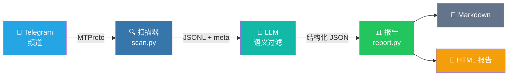

<div align="center">

<p>
  
</p>

<h3>把 Telegram 频道噪音变成可行动的每日信号报告。</h3>

<p>
  <a href="https://www.python.org/downloads/"></a>
  <a href="LICENSE"></a>
  <a href="https://core.telegram.org/mtproto"></a>
  <a href="https://github.com/Sapientropic/tg-channel-scanner"></a>
  
</p>

<p><strong>读取已订阅频道 -> 应用 Markdown Profile -> 生成自包含 HTML 报告。</strong></p>

<p>适合求职线索、空投监控、市场/新闻追踪，以及任何“频道太多、信号太少”的 Telegram 工作流。</p>

<p>
  <a href="README.md"><strong>English</strong></a>
  ·
  <a href="#演示"><strong>演示</strong></a>
  ·
  <a href="#快速开始"><strong>快速开始</strong></a>
  ·
  <a href="#报告输出"><strong>报告输出</strong></a>
  ·
  <a href="ROADMAP.md"><strong>路线图</strong></a>
  ·
  <a href="#安全与-telegram-tos"><strong>安全边界</strong></a>
</p>

</div>

<table>
  <tr>
    <td align="center"><strong>Profile 驱动</strong><br>用普通 Markdown 定义什么值得保留、拒绝或继续调查。</td>
    <td align="center"><strong>按时间截断</strong><br>通过 Telethon/MTProto 读取，遇到超过时间窗口的消息就停止。</td>
    <td align="center"><strong>报告可直接读</strong><br>生成单文件 HTML，包含语义标签、来源链接、原文上下文和统计信息。</td>
  </tr>
</table>

## 演示

<!--
GitHub renders bare user-attachments asset URLs as inline video players.
Do not replace this with a Release MP4 URL; those are served as downloads.
-->
<div align="center">

https://github.com/user-attachments/assets/4d63e490-8e9b-46d4-a65e-e94a65e1d7f8

</div>

<p align="center"><em>56 秒产品演示预览。</em></p>

---

## 快速开始

### 前置条件

- Python 3.12+
- Telegram 账号（手机号）
- Telegram API 凭证（`api_id` + `api_hash`，[获取方法](docs/getting-api-credentials.md)）

### 安装

```bash
git clone https://github.com/Sapientropic/tg-channel-scanner.git
cd tg-channel-scanner
chmod +x setup.sh scripts/scan.sh
./setup.sh
```

### 配置 & 运行

```bash
# 1. 编辑配置，填入 Telegram API 凭证
#    （setup.sh 已创建在 ~/.config/tgcli/config.toml）
nano ~/.config/tgcli/config.toml

# 2. 扫描频道（首次运行引导登录）
source .venv/bin/activate
./scripts/scan.sh channel_lists/example.txt

# 3. 生成 HTML 报告
python scripts/daily_report.py channel_lists/example.txt \
  --profile profiles/example.md --html
```

### 扫描选项

```bash
# 过去 24 小时（默认）
./scripts/scan.sh channel_lists/example.txt

# 过去 7 天
./scripts/scan.sh channel_lists/example.txt 168

# 从精确 ISO-8601 时间点
./scripts/scan.sh channel_lists/example.txt --since 2026-05-06T07:30:00Z
```

扫描器使用 Telethon（MTProto）+ `iter_messages` 流式读取，遇到超过 cutoff 的消息立刻停止，不会过度拉取。

<details>
<summary>环境变量</summary>

```bash
SCAN_INITIAL_LIMIT=200   # 每个频道初始读取 limit
SCAN_MAX_LIMIT=5000      # 硬上限
SCAN_DELAY=1             # 频道间等待秒数
SCAN_MAX_FLOOD_WAIT_SECONDS=300
TG_SCANNER_CONFIG_DIR=~/.config/tgcli
```

</details>

### 从 Telegram 导出频道

```bash
python scripts/export_folder.py --list
python scripts/export_folder.py --folder "Jobs" --output channel_lists/jobs.txt
```

### 生成报告

```bash
# Markdown + HTML 报告
python scripts/daily_report.py channel_lists/example.txt \
  --profile profiles/example.md --html

# 自定义 LLM 端点（DeepSeek、Ollama 等）
python scripts/report.py --input output/scan_XXXX.jsonl \
  --profile profiles/example.md \
  --base-url https://api.deepseek.com/v1 --model deepseek-chat

# 脱敏后再发给 LLM
python scripts/report.py --input output/scan_XXXX.jsonl \
  --profile profiles/example.md --redact-contact-info

# 预览 prompt 不调用 LLM
python scripts/report.py --input output/scan_XXXX.jsonl \
  --profile profiles/example.md --dry-run-prompt output/prompt-preview.md
```

## 报告输出

生成的报告不是日志堆叠，而是一个决策界面：哪些内容重要、为什么命中、来自哪里、是否值得行动。

<table>
  <tr>
    <td align="center" width="50%">
      <br>
      <sub>运行摘要、Profile 信息和质量统计。</sub>
    </td>
    <td align="center" width="50%">
      <br>
      <sub>排序结果、匹配理由、原文展开和 Telegram 来源链接。</sub>
    </td>
  </tr>
</table>

HTML 报告为单文件自包含格式：OKLCH 色标（绿=申请、琥珀=调查、灰=跳过）、卡片入场动画、可展开原文、Telegram 深链接。

<details>
<summary>定时任务示例</summary>

```bash
# cron：每天 09:00
0 9 * * * cd /path/to/tg-channel-scanner && .venv/bin/python scripts/daily_report.py channel_lists/example.txt --profile profiles/example.md
```

```bat
REM Windows Task Scheduler
cmd /c "cd /d C:\path\to\tg-channel-scanner && .venv\Scripts\python.exe scripts\daily_report.py channel_lists\example.txt --profile profiles\example.md"
```

</details>

<details>
<summary>自由格式 AI 摘要 & Media OCR</summary>

**自由格式摘要**（无固定排版，纯摘要）：

```bash
python scripts/summarize.py --input output/scan_XXXX.jsonl --profile profiles/example.md
```

**Media OCR/STT**（默认关闭）：

```bash
# xAI vision
export XAI_API_KEY=your-key
./scripts/scan.sh channel_lists/example.txt --ocr --ocr-provider xai

# OpenAI vision
export OPENAI_API_KEY=sk-your-key
./scripts/scan.sh channel_lists/example.txt --ocr --ocr-provider openai

# 自定义端点
./scripts/scan.sh channel_lists/example.txt --ocr --ocr-provider custom \
  --ocr-base-url http://localhost:11434/v1 --ocr-model your-vision-model
```

视频 OCR 默认只走缩略图，独立重处理命令 `python scripts/ocr_media.py` 也是如此。
只有明确需要完整视频处理时，扫描命令才使用 `--ocr-full-video`，独立命令才使用
`--full-video`。完整视频模式需要 `ffmpeg`，并可能把提取的视频帧、音频或转写文本
发送给所选 OCR/STT provider；开启前先确认隐私和成本边界。

</details>

---

## 工作原理



1. **读取** — Telethon 读取已订阅频道消息
2. **过滤** — 精确时间截断 + 提前终止
3. **保存** — JSONL + `.meta.json`
4. **报告** — LLM 语义匹配 → Python 渲染统计 + Markdown/HTML

数据合同：每条扫描消息都会带稳定 `message_ref`（`channel` + `id`）。报告要求
LLM 输出 `source_message_refs`，并用这个按频道限定的 key 查原文；`source_message_ids`
只保留作旧 JSONL/旧报告兼容。每日流水线会把本轮 scan 的明确 `--output` 路径传给
`report.py`，不会静默复用输出目录里的旧 `scan_*.jsonl`。

## Profile 与频道列表

### Profile

复制 `profiles/example.md` 并编辑：

```markdown
## 候选人
- 目标岗位：前端工程师
- 技术栈：React, TypeScript, Next.js
- 级别：Middle/Senior
- 工作方式：远程优先

## 筛选规则
- 只包含过去 24 小时内的职位
- 去重（同公司 + 同岗位）
- 排除：纯后端、移动端、DevOps...
```

自定义模式（空投、新闻、活动）添加 `## Extraction Schema`、`## Extraction Prompt`、`## Report Labels` 即可。见 `profiles/example-airdrop.md`。

### 频道列表

在 `channel_lists/` 下创建 `.txt`，使用 **Telegram 用户名**（不是显示名），每行一个：

```
remote_italic
dev_jobs_remote
react_jobs
```

> 获取用户名：Telegram 打开频道 → 点击名称 → 查看 @username。

或直接导出：`python scripts/export_folder.py --folder "Jobs" --output channel_lists/jobs.txt`

## 目录结构

```
tg-channel-scanner/
├── config.example.toml      # 配置模板（实际配置在 ~/.config/tgcli/）
├── requirements.txt         # telethon
├── requirements-llm.txt     # 可选摘要依赖
├── setup.sh / setup.bat     # 一键安装
├── profiles/                # 筛选 profile
├── channel_lists/           # 频道名称列表
├── scripts/
│   ├── scan.py              # 扫描核心（Telethon）
│   ├── export_folder.py     # 从 Telegram 文件夹导出
│   ├── report.py            # 报告生成器（Markdown + HTML）
│   ├── daily_report.py      # 扫描 + 报告流水线
│   └── summarize.py         # 自由格式摘要
├── templates/
│   ├── report-job.html      # OKLCH 色板模板
│   └── report-generic.html  # 自定义模式模板
├── output/                  # 已 gitignore
└── docs/
    └── screenshots/         # 报告截图
```

## 安全与 Telegram ToS

- 只读取你已订阅的频道
- 尊重 `FloodWaitError`，不滥用 API
- 使用真实账号，非新建/虚拟号
- 不要将 Telegram 数据用于 AI 训练、转售或批量采集

详见 [docs/tos-risk-analysis.md](docs/tos-risk-analysis.md)。

## 常见问题

| 问题 | 解决 |
|------|------|
| `ModuleNotFoundError: telethon` | `source .venv/bin/activate` |
| `.sh` 脚本 `Permission denied` | `chmod +x setup.sh scripts/scan.sh` |
| my.telegram.org 显示 ERROR | [获取凭证指南](docs/getting-api-credentials.md) |
| 扫描到 0 条消息 | 检查 `output/*.errors.log` |
| Session 过期 | 删除 `~/.config/tgcli/session`，重新运行 |

## 许可证

MIT
