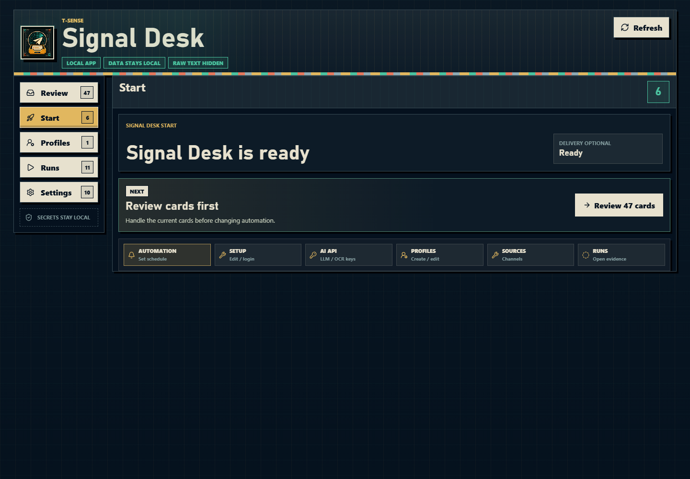
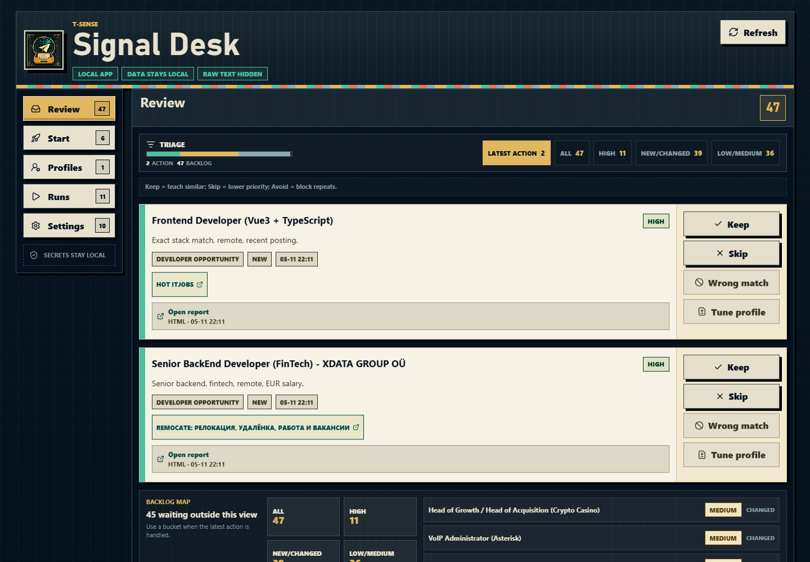
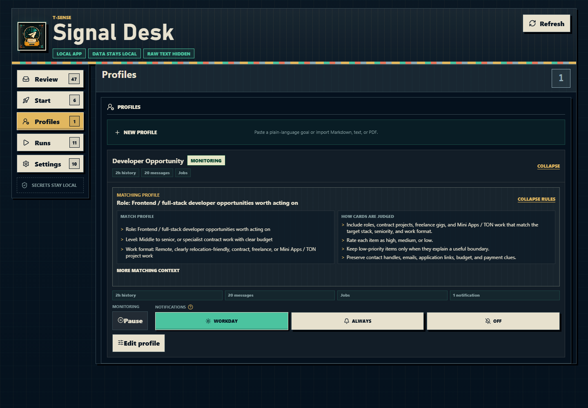

<div align="center">

<p>
  
</p>

<h3>机会已经在噪音里了。T-Sense 把真正该看的信号捞出来。</h3>

<p>
  <a href="README.md"><strong>English</strong></a>
  ·
  <a href="#signal-desk"><strong>Signal Desk</strong></a>
  ·
  <a href="#demo"><strong>Demo</strong></a>
  ·
  <a href="#快速开始"><strong>快速开始</strong></a>
  ·
  <a href="#agent--cli"><strong>Agent / CLI</strong></a>
  ·
  <a href="#隐私与安全边界"><strong>隐私</strong></a>
  ·
  <a href="ROADMAP.md"><strong>路线图</strong></a>
</p>

</div>

T-Sense 会读取你已经有权限访问的 Telegram 频道，用 Markdown profile 判断
哪些消息值得看，再把结果放进本地工作流里处理。它不是只服务求职场景：
内置模板覆盖市场/新闻、空投、研究线索、竞品监控和开发者机会。

**Signal Desk** 是 T-Sense 里的本地浏览器 dashboard，用来完成 setup、扫描、
Review、profile 调整、运行健康检查和设置，避免普通用户一上来就被 CLI 流程挡住。

## Demo

49 秒 Demo 视频展示 T-Sense 如何从频道噪音里抽出信号，并生成本地可复查的信号简报。

https://github.com/user-attachments/assets/cf69300b-85cf-49b2-ab15-a0320945115c

## Signal Desk

Signal Desk 运行在 `127.0.0.1`。普通用户优先在 app 里完成操作，不需要从编辑
TOML、复制 JSON 或背 CLI 命令开始。

<p align="center">
  
</p>

<table>
  <tr>
    <td width="50%">
      
    </td>
    <td width="50%">
      
    </td>
  </tr>
</table>

### Dashboard 里能做什么

| 页面 | 用途 |
| --- | --- |
| `Start` | 连接 Telegram、修复 setup、跑 demo / dry scan、管理自动扫描入口。 |
| `Review` | 优先处理最新/最高优先级卡片，用 Keep / Skip / Wrong match / Tune profile 训练后续匹配。 |
| `Profiles` | 用自然语言或文件新建 profile，编辑匹配规则，调整扫描窗口和读取数量。 |
| `Runs` | 看最近扫描是否健康，打开本地报告 artifact。 |
| `Settings` | 用 starter / Source assistant 增删来源，配置 AI/OCR key、通知、学习结果和仓库状态。 |

Signal Desk 保持 local-first：dashboard 状态不会保存 Telegram 原文、session、
API key 或 bot token。

保存 Telegram bot token 和 chat 后，也可以开本地 Bot Gateway：

```bash
./tgcs bot run
```

启动时会自动安装 Telegram 命令菜单。Bot 可查看状态、跑 dry scan、看最新结果、预览 source 变更；删除/暂停这类变更仍需要点击 Apply 确认。

后台模式只表示本地 scheduler 会尝试启动 gateway，不等于它现在一定在跑。如果 Settings 显示
gateway stale 或 not detected，先关闭再打开后台模式，或手动运行 `./tgcs bot run`。

## 快速开始

环境要求：

- Python 3.12+。
- 如果要在本机自动构建 dashboard 资源，需要 Node.js 20.19+ 或 22.12+。

### Windows

1. 安装 Python 3.12+。
2. 下载或 clone 本仓库。
3. 双击 `Signal Desk.bat`。
4. 浏览器打开后，保持启动器窗口开着。

启动器会准备本地 Python 环境；如果有 Node.js 20.19+ 或 22.12+ 及 npm，也会构建 dashboard
资源。它会优先复用已经运行的兼容 Signal Desk；如果 `8765` 被其他本地服务占用，再尝试
`8766-8799`。

### macOS / Linux

```bash
git clone https://github.com/Sapientropic/T-Sense.git
cd T-Sense
chmod +x setup.sh tgcs signal-desk "Signal Desk.command"
./signal-desk
```

`./signal-desk` 是推荐的 app-like 入口：首次运行会执行 setup，缺少本地默认配置时
初始化 jobs starter，然后打开 Signal Desk。macOS 也可以从 Finder 打开
`Signal Desk.command`。`./tgcs ...` 保留为专家 CLI 路径。

本地 key 存储、自动扫描安装和 Linux headless 边界集中放在
[docs/desktop-platforms.md](docs/desktop-platforms.md)，README 只保留启动路径。

### 第一轮有效结果

1. 在 `Start` 创建离线 demo 报告；这一步不需要 Telegram 登录，也不需要 LLM key。
2. 用 [my.telegram.org/apps](https://my.telegram.org/apps) 的 `api_id` / `api_hash`
   连接 Telegram。
3. 在 `Start` / `Settings -> Sources` 添加并检查来源：starter、粘贴 handle，或让 Source assistant 预览并应用变更。
4. 从 `Start` 跑一次 dry scan；如果来源访问失败，先用 source access 修复按钮处理，再重新扫描。
5. 在 `Review` 处理卡片；如果结果太宽或太窄，再去 `Profiles` 调整匹配规则。
6. 如果扫描失败，打开 `Runs`，它会先给出修复路径，再让你重新扫描。

## Profiles

Profile 是一份 Markdown 规则，描述什么算信号、追踪哪些主题/实体、什么应该排除、
偏好什么语言和来源、报告里要如何呈现。

你可以直接在 Signal Desk 里：

- 写一段自然语言目标；
- 导入 Markdown、TXT 或 PDF；
- 手动编辑匹配规则；
- 根据 Review 中确认过的反馈生成 profile 修改建议，再一键应用。

内置模板覆盖市场/新闻、空投、研究线索、竞品监控和开发者机会。`market-news`
是默认 starter；只有明确要跟踪开发者机会时才使用 `jobs-fast`。

## Output 与 Review 卡片

每次扫描都可以生成一个自包含暗色主题 HTML 报告，包含卡片、来源链接、判断标签、
诊断信息和运行元数据。报告标题和标签来自当前 profile，所以市场简报、研究简报和
工作机会报告不会被强行塞进同一套文案。

<table>
  <tr>
    <td width="50%">
      
    </td>
    <td width="50%">
      
    </td>
  </tr>
</table>

T-Sense 把生成产物留在本地，不进 Git：

| 路径 | 放什么 | Desk 行为 |
| --- | --- | --- |
| `output/runs/<run_id>/` | monitor run、历史 scan 导入、报告、manifest、scan sidecar。 | 会创建/更新 Review 卡片，并让报告证据可打开。 |
| `output/<name>` | demo 报告、一次性手动报告、feedback export、截图、eval。 | 可以打开 report/brief 文件，但不会自动变成 Review 卡片。 |

如果历史 scan 或手动 scan 需要进入 Review，走
`tgcs monitor run --scan-input ...`，不要只渲染报告。完整产物合同见
[docs/output-artifacts.md](docs/output-artifacts.md)。

## Agent / CLI

短命令 `tgcs` 继续作为兼容 CLI，适合人类和 smoke test：

```bash
./tgcs demo
./tgcs doctor --profile market-news
./tgcs login
./tgcs monitor run --profile-id market-news --delivery-mode dry-run
./tgcs dashboard --open
```

Agent 和自动化应优先使用 JSON 化脚本，以及
[docs/agent-cli-contract.md](docs/agent-cli-contract.md) 中的稳定合同。Telegram 原文应该留在本地
artifact，不要塞进 prompt、日志或公开文档。

常用底层命令：

```bash
python scripts/source_registry.py import-list channel_lists/example.txt \
  --source-registry .tgcs/sources.json --topic market-news --format json

python scripts/monitor.py run --profile-id market-news \
  --delivery-mode dry-run --format json

python scripts/monitor.py feedback-export \
  --db .tgcs/tgcs.db --output output/feedback/review-feedback.jsonl --format json
```

## 隐私与安全边界

- Telegram 访问通过 Telethon / MTProto，只读取你本来就能访问的来源。
- secrets 留在本机；`.tgcs/`、`output/`、session、日志、env 文件和 dashboard build 都被 Git 忽略。
- Signal Desk 在可用时使用本机 OS-backed secret storage；环境变量仍是稳定的专家 fallback。
- live delivery 和 live schedule 都需要明确开启；默认先 dry-run。
- 这是本地个人工作流工具。使用时仍应遵守 Telegram 条款和频道规则。

## 仓库结构

| 路径 | 用途 |
| --- | --- |
| `Signal Desk.bat` | Windows app 式启动器。 |
| `signal-desk` / `Signal Desk.command` | macOS/Linux app 式启动器。 |
| `dashboard/` | Signal Desk 的 React dashboard 源码。 |
| `scripts/` | 扫描、报告、monitor、source registry、delivery 和 dashboard server。 |
| `profiles/` | Markdown profile 模板和 starter 配置。 |
| `channel_lists/` | 示例频道列表输入。 |
| `templates/` | 报告模板，以及 `tgcs demo` 使用的 demo fixture。 |
| `docs/desktop-platforms.md` | 桌面启动器、本地 key 存储和自动扫描平台边界。 |
| `docs/output-artifacts.md` | 本地 `output/` 产物分层、Desk 可打开报告路径和清理策略。 |
| `docs/agent-cli-contract.md` | 给 agent 使用的稳定 JSON / CLI 合同。 |
| `docs/testing.md` | 本地测试与质量门槛命令入口。 |
| `docs/getting-api-credentials.md` | Telegram API 凭证获取指南。 |
| `docs/tos-risk-analysis.md` | ToS 与运行风险说明。 |

## 开发验证

本地测试和质量门槛命令统一看 [docs/testing.md](docs/testing.md)。其中也说明了
dirty worktree 下如何验证 staged index。

## License

本项目采用 AGPL-3.0，并提供商业授权选项。见 [LICENSE](LICENSE) 和
[docs/licensing.md](docs/licensing.md)。
